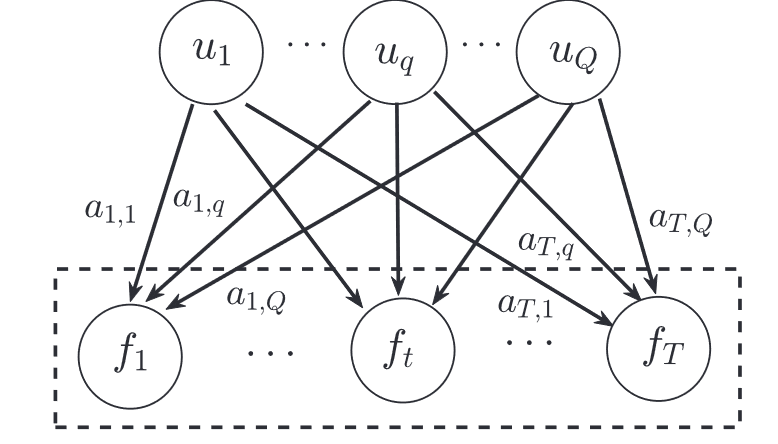

# 高斯过程

在讨论行为人离散多期学习时，一种合适的方法是非参数拟合——行为人通过思考（或外界信息）获取对应特定状态的最优动作，并更新自身知识库——对任意状态$\mathbf{s}_t$，估计$a^{*}(\mathbf{s}_t)$的分布，并（通常）选取分布的均值作为下一次遇到$s_t$状态时的动作方案。因此，基于高斯核函数的随机过程Gaussian Process（下称“高斯过程”或GP）是一种合适的非参数模型。

/// details | 参考书目、文献和网站
    type: info

    下文内容中所涉及具体方法的参考文献，参考对应方法的折叠栏，此处不再列出。

1. 图书Gaussian Process for Machine Learning（Rasmussen and Williams，2006），网址: <https://ieeexplore.ieee.org/book/6267323/>
2. 知乎专栏《高斯世界下的Machine Learning》，作者“蓦风星吟”，网址：<https://www.zhihu.com/column/gpml2016>
3. Alvarez, M. A., Rosasco, L., & Lawrence, N. D. (2012). Kernels for vector-valued functions: A review. Foundations and Trends® in Machine Learning, 4(3), 195-266. <https://arxiv.org/abs/1106.6251> (关于多维输出的高斯过程)
4. Liu, H., Cai, J., & Ong, Y.-S. (2018). Remarks on multi-output Gaussian process regression. Knowledge-Based Systems, 144, 102–121. <https://doi.org/10.1016/j.knosys.2017.12.034>

///

## 预备知识：从高斯分布开始

就正态分布嘛。比如对于一维随机变量$x$来说，如果$x \sim \mathcal{N}(\mu,\sigma^2)$，则$x$的概率密度函数为：

$$
PDF(x) = \frac{1}{\sigma\sqrt{2\pi}} \exp \left(-\frac{(x-\mu)^2}{2\sigma^2} \right)\tag{1}
$$

再熟悉不过的分布函数，其中$\mu$是均值，$\sigma^2$是方差，二者共同唯一地决定了$x$的概率分布，或者说笛卡尔坐标系下$x$分布曲线的形状。但显然，很多时候一维分布是不够用的，比如说很多系统中状态空间的维度都是高于一维的，这时候就需要多维的高斯分布了，如果$x_1,...,x_n$互相独立，则其联合概率分布为：

$$
\begin{aligned}
& p\left(x_1, x_2, \ldots, x_n\right)=\prod_{i=1}^n p\left(x_i\right) \\
& =\frac{1}{(2 \pi)^{\frac{n}{2}} \sigma_1 \sigma_2 \ldots \sigma_n} \exp \left(-\frac{1}{2}\left[\frac{\left(x_1-\mu_1\right)^2}{\sigma_1^2}+\frac{\left(x_2-\mu_2\right)^2}{\sigma_2^2}+\ldots+\frac{\left(x_n-\mu_n\right)^2}{\sigma_n^2}\right]\right)
\end{aligned}
$$

也不麻烦，由于上面假定了$x_1,...,x_n$的两两独立，故$\mathbf{x} - \mathbf{\mu} = [x_1-\mu_1,...,x_n - \mu_n]$的协方差矩阵$\Sigma$是一个对角矩阵，即$\Sigma = \text{diag}(\sigma_1^2,...,\sigma_n^2)$，从而有：

$$
\sigma_1 \sigma_2 ... \sigma_n = |\Sigma|^{1/2}
$$

那么联合分布的密度函数可以写成向量的形式：

$$
p(x) = (2\pi)^{-n/2} |\Sigma|^{-1/2} \exp \left(-\frac{1}{2} (\mathbf{x}-\mathbf{\mu})^T \Sigma^{-1} (\mathbf{x}-\mathbf{\mu}) \right)
$$

## 高斯过程

### a. 基本结构

首先引用GPML一书（第2.2章，pp.13）中对高斯过程的描述：

> (Definition 2.1) A Gaussian process is a collection of random variables, any finite number of which have a joint Gaussian distribution.
>
> (定义2.1) 高斯过程是一个随机变量的联合，其中任意有限个随机变量的联合分布都是高斯分布。

这一系列随机变量是出现在一个连续域之中的，而且对于任何的时间、空间，这个变量集的任何子集都服从（多维）高斯分布。高斯分布是由期望和方差来构造的，对应的，高斯过程也完全由期望函数（mean func）和协方差函数（covariance func）来构造。对于实过程$f(\mathbf{x})$，分别定义期望函数$m(\mathbf{x})$和协方差函数$k(\mathbf{x}, \mathbf{x'})$：

$$
m(\mathbf{x}) = E[f(\mathbf{x})]; \quad k(\mathbf{x}, \mathbf{x'}) = E[(f(\mathbf{x})-m(\mathbf{x}))(f(\mathbf{x'})-m(\mathbf{x'}))]
$$

从而写出$f(\mathbf{x})$作为高斯过程的形式：

$$
f(\mathbf{x}) \sim \mathcal{GP} [m(\mathbf{x}), k(\mathbf{x}, \mathbf{x'})]
$$

对于任意的$\mathbf{x}, \mathbf{x'}$，$k(\mathbf{x}, \mathbf{x'})$都是一个实数，且$k(\mathbf{x}, \mathbf{x'}) = k(\mathbf{x'}, \mathbf{x})$，即协方差函数是对称的。协方差矩阵也可以很容易地写出来。注意，这里用$k$来表示协方差函数，是因为在GP中，协方差函数也被称为kernel，即广为人知的“核函数”。Shepard（1978）的工作表明人类的泛化学习服从指数衰减规律，因此这里通常会讨论Squared Exponential（SE，平方化指数函数）形式的核函数，即：

$$
K_{SE}(x,x') = \exp \left(-\frac{||x-x'||^2}{2l^2}\right)
$$

### b. 高斯过程回归

> 高斯过程回归的“学习原理”可以参照<https://zhuanlan.zhihu.com/p/44960851>。尽管存在先验分布，但由于缺乏训练数据，基于先验分布的多次采样得到的$f(x)$估计函数可能在$\mathbf{x}$上完全不同。但是，随着观测数据的学习，贝叶斯学习$f(x)$得到后验分布，基于后验分布的多次采样函数可能就比较收敛（主要在有数据的区间内收敛，而缺乏训练数据的区间则可能依然我行我素）。

假定$f(x)$中$x \in R^d$，并服从单输出的GP，即：$f(\mathbf{x}) \sim \mathcal{GP} [m(\mathbf{x}), k(\mathbf{x}, \mathbf{x'})]$。并假定其核函数为SE核：

$$
K_{SE} (\mathbf{x}, \mathbf{x'}) = \sigma_f^2 \exp \left(-\frac{(\mathbf{x} - \mathbf{x'})^T P^{-1} (\mathbf{x} - \mathbf{x'})}{2} \right)
$$

这是一个ARD的形式，在下面“多维输入高斯过程”中具体讨论，这里只需要知道$\sigma_f$决定了核函数的输出尺度，$P$是一个对称阵，其每个对角元素都规定了输入变量$x_i$的lengthscale（长度尺度）。假定行为人观测到的数据是无偏的：

$$
y(\mathbf{x}) = f(\mathbf{x})+\epsilon, \quad \epsilon \sim N(0,\sigma_s^2)
$$

假定训练点$X = \{\mathbf{x}_1,...,\mathbf{x}_n\}^T$, 对应输出$\mathbf{y} = \{y(\mathbf{x}_1), ..., y(\mathbf{x_n})\}^T。因为GP是一个随机过程，随机变量的任何子集服从多维高斯分布，因此测试点$x_{*}$处观测$\mathbf{y}$与输出$f(x_{*})$的联合先验分布为：

$$
\left[\begin{array}{l}
\mathbf{y} \\
f_*
\end{array}\right] \sim \mathcal{N}\left(\left[\begin{array}{l}
\mathbf{0} \\
0
\end{array}\right],\left[\begin{array}{cc}
K(X, X)+\sigma_s^2 I & \mathbf{k}\left(X, \mathbf{x}_*\right) \\
\mathbf{k}\left(\mathbf{x}_*, X\right) & k\left(\mathbf{x}_*, \mathbf{x}_*\right)
\end{array}\right]\right)
$$

其中$K(X,X) \in R^{n \times n}$是对称且半正定的协方差阵，其中$K_{ij} = k(x_i, x_j)$。学习$\{X,y\}$后，$f(x_{*})$的后验分布为：$f(x_{*}) \mid X, y , x_{*} \sim N(\hat f(x_{*}),\sigma^2(x_{*}))$。其中：

$$
\begin{aligned}
&\hat{f}\left(\mathbf{x}_*\right)=\mathbf{k}_*^{\top}\left[K(X, X)+\sigma_s^2 I\right]^{-1} \mathbf{y}\\
&\sigma^2\left(\mathbf{x}_*\right)=k\left(\mathbf{x}_*, \mathbf{x}_*\right)-\mathbf{k}_*^{\top}\left[K(X, X)+\sigma_s^2 I\right]^{-1} \mathbf{k}_*,
\end{aligned}
$$

其中$k_{*} = K(X,x_{*}) \in R^{n\times 1}$表示$n$个训练点和测试点$x_{*}$的协方差。显然，预测$y(x_{*})$的方差就是$\sigma^2(x_{*}) + \sigma_s^2$。

在以上的学习之外，还要考虑超参数$\mathbf{\theta}$的设定和优化问题，例如核函数中的$P$和$\sigma_f$，以及观测中的$\sigma^2_s$等，优化的方法是最小化负对数似然函数（NLML），然后使用梯度下降法求解。NLML的表达式为：

$$
NLML = -\log p(y \mid X, \theta) = \frac{1}{2} y^T [K(X,X) + \sigma_s^2 I]^{-1}y + \frac{1}{2} \log |K(X,X) + \sigma_s^2 I| + \frac{n}{2} \log 2\pi
$$

## 高斯过程的多维输入和多维输出

### a. 多维输入

回归GP的基本形式：$f(\mathbf{x}) \sim \mathcal{GP} [m(\mathbf{x}), k(\mathbf{x}, \mathbf{x'})]$，并有：

$$
m(\mathbf{x}) = E[f(\mathbf{x})]; \quad k(\mathbf{x}, \mathbf{x'}) = E[(f(\mathbf{x})-m(\mathbf{x}))(f(\mathbf{x'})-m(\mathbf{x'}))]
$$

显然，高斯过程由$m$和$k$决定，二者均允许多维的输入——$\mathbf{x}$是向量，可以接受若干个状态变量的输入，所以，Multi-input GP是天然支持的。仍然从mean和covariance两个方面来说：对于均值，一般置0，不做讨论；对于协方差，就要重视$\mathbf{x,x'}$的向量性质。核函数的核心思想是表现两个值（向量）的距离，因此，核函数要引入的概念是norm，即范数，如SE核改为：

$$
K_{SE}(x,x') = \exp \left(-\frac{||x-x'||^2}{2l^2}\right)
$$

其中$l$是lengthscale，即长度尺度，用来控制核函数的变化速度，即使在多输入的GP中，lengthscale仍然是一个标量——对所有输入变量都有相同的影响。大多数情况下，单一的lengthscale已经够用，而且降低了计算的难度，但如果状态变量的数量很多，那么单一的lengthscale可能无法很好地表达不同状态变量之间的关系，这时候就需要引入多个lengthscale，被称作ARD（Automatic Relevance Determination）核函数，以SE核为例：

$$
K_{SE, ard} (\mathbf{x}, \mathbf{x'}) = s_f^2 \exp \left(-\frac{(\mathbf{x} - \mathbf{x'})^T \Theta^{-1} (\mathbf{x} - \mathbf{x'})}{2} \right)
$$

其中，$\Theta$是一个对角矩阵，对角线上的元素是各个状态变量的lengthscale，$s_f^2$是一个标量，用来控制核函数的输出尺度。这样，核函数就可以很好地表达不同状态变量之间的关系了。不过，lengthscale的作用主要体现在特征工程上，而对基于GP进行学习和决策的行为人来说，lengthscale是外生的，它自己并不能调整。

> 其他部分核函数的ARD形式可参照<https://zhuanlan.zhihu.com/p/35396322>的第5部分。

但是，$m$和$k$的输出都是标量，所以GP天然的是$\mathbb{R}^n \to \mathbb{R}$的映射，即多维输入，单维输出。那么，如何实现多维的输出呢？

### b. 多维输出(问题表述)

关于Multi-output Gaussian Process，即MOGP的内容。目前MOGP主要分为两个条线：对称MOGP和非对称MOGP，二者的共同点是都通过考虑各个输出变量间的相关性来做近似，从而改进各自为战的训练方法。但在详细讨论各个方法之前，首先明确MOGP的概念和符号。

> 首先我们明确，我们需要观测、学习并通过GP输出的变量一共有$T$个，这里的$t$不是时间的概念。对于第$t$个输出变量，我们有$n_t$个训练集数据。如果$n_1 = n_2 = ... = n_T$，我们称之为对称的MOGP，对称MOGP可以适用于非同质化数据，即$X_1 \not = X_2 \not = ... \not = X_T$的情况，也适用于同质化数据。如果$n_1 > n_2 > ... > n_T$（假定输出变量按数据集丰富程度排序），则称之为非对称的MOGP，非对称MOGP只适用于非同质化数据（显然也没有同质化数据可用），非对称MOGP的一个重要工作就是通过易得（低廉）的输出$f_1,...,f_{T-1}$来改进难得（高昂）输出$f_T$的预测。

$\mathbf{X} = \{X_{t,i}\mid t = 1,...,T; i = 1,...n_t\}$和$\mathbf{y} = \{y_{t,i} = y_t (\mathbf{X_t}) \mid t = 1,...,T; i = 1,...,n_t\}$是所有训练节点和对应观测的集合。假定$N = \sum_{t=1}^T n_t$，矩阵$X \in \mathbb{R}^{N \times d}$有$T$个块，其中第$t$个块$X_t = \{\mathbf{x}_{t,1},...,\mathbf{x}_{t,n_t}\}^T$是对应于输出$f_t$的训练集。$\mathbf{y}\in \mathbb{R}^{N\times 1}$也有$T$个成分，其中$\mathbf{y}_t = \{y_{t,1},...,y_{t,n_t}\}^T$，是在状态$X_t$下对$f_t$的观测。

在已知$T$个阶段的训练数据$\mathcal{D} = \{X,\mathcal{y}\}$时，目标就是训练MOGP模型：

$$
MOGP: \Omega_d \to \Omega_{f_1} \times ... \times \Omega_{f_T}
$$

其中$\Omega_d$是输入的样本空间，代表有$d$维的输入变量，$\Omega_{f_t}$表示输出$f_t(\mathbf{x})$的空间，为方便起见，假定输出变量$t= 1,...,T$具有相同的输入空间。下面表述的内容默认$X_1,...,X_T = \bar X$，即任何输出变量所对应的输入点集都完全相同。我们假定，全部$T$个输出$\mathbf{f} = \{f_1,...,f_T\}^T$服从高斯过程：

$$
\mathbf{f(x)} \sim \mathcal{GP}(\mathbf{0}, \mathcal{K}_M (\mathbf{x,x'}))
$$

其中，多维输出协方差$\mathcal{K}_M(\mathbf{x,x'}) \sim R^{T\times T}$被定义为：

$$
\kappa_M (\mathbf{x,x'}) = \left\{\begin{array}{ccc}
k_{11}(\mathbf{x,x'}) & ... & k_{1T}(\mathbf{x,x'}) \\
... & ... & ... \\
k_{T1}(\mathbf{x,x'}) & ... & k_{TT}(\mathbf{x,x'})
\end{array}\right\}
$$

其中，$k_{tt'}(\mathbf{x,x'})$表示$f_t(x)$和$f_{t'}(x')$之间的协方差，$t,t' = 1,...,T$。类似的，我们假定观测是无偏的：$y_t(\mathbf{x}) = f_t(\mathbf{x}) + \epsilon_t$，且$\epsilon_t \sim N(0,\sigma_{s,t}^2)$独立同分布。则全部$T$个输出的似然函数可以写为：

$$
p(\mathbf{y} | \mathbf{f,x}, \Sigma_S) = N(\mathbf{f}(\mathbf{x}), \Sigma_S)
$$

其中$\Sigma_S \sim R^{T\times T}$是对角矩阵，其对角元素为$\{\sigma_{s,t}^2\}, t = 1,...,T$。要注意$\sigma_{f,t}$关于$t$的分布并不相同，这是特意为之的，用于捕捉特定于输出的特征。进一步，给定训练集$X = \{X_1,...,X_T\}^T和输出观测\mathbf{y} = \{y_1,...,y_T\}^T$，在观测点$x_{*}$，观测$f(x_{*}) = \{f_1(x_{*}),...,f_T(x_{*})\}^T$的后验分布可以推导为：

$$
\mathbf{f}(x_{*}) \mid X,\mathbf{y},\mathbf{x_{*}} \sim N(\hat{\mathbf{f}}(\mathbf{x}_{*}), \Sigma_{*})
$$

其中：

$$
\begin{align}
\hat{\mathbf{f}}(\mathbf{x}_{*}) &= K_{M*}^T [K_M(\bar X,\bar X) + \Sigma_M]^{-1}\mathbf{y}\\
\Sigma_{*} &= \mathcal{K}_M(x_{*},x_{*}) - K_{M*}^T [K_M(\bar X,\bar X) + \Sigma_M]^{-1}K_{M*}
\end{align}
$$

其中，$K_{M*} = K_M(\bar X, x_{*}) \sim R^{nT \times T}$，其中的$K_{tt'}(\bar X, x_{*}) = [k_{tt'}(\mathbf{x}_i, \mathbf{x}_{*})], i = 1,...,n; t,t' = 1,...,T$。$\mathcal{K}_M(x_{*},x_{*})$中的元素为$k_{tt'}(x_{*},x_{*})$。$\Sigma_{*}$的第$t$个对角项为$\sigma_t^2(\mathbf{x}_{*})$。下一项$\Sigma_M = \Sigma_S \otimes I_n \sim R^{nT \times nT}$，这是一个表示噪声的对角矩阵，运算符“$\otimes$”表示这是一个Kronecker product。

类似的，这里也涉及到大量的超参数$\mathbf{\theta}_{M}$，包括$\mathbf{\theta}_{k_{tt'}}$和$\mathbf{\theta}_{\sigma_{s,t}}$。这些超参数还是通过最小化NLML来确定。

### c. 对称MOGP
（可参考<https://zhuanlan.zhihu.com/p/386642796>）

目前的模型有（1）可分模型，将输入、输出分割开来处理（可以理解为两层的非参数估计）；（2）不可分割的混合卷积；（3）转换模型——将输出看作新的输入，将多输出模型转化为一层层的单输出模型。

第一种的常见方法为LMC和ICM。
/// details | Linear Model of Coregionalization (LMC) 
    type: notes

    （参考：Journel, A. G., & Huijbregts, C. J. (1976). Mining geostatistics.）
    
<figure markdown>
  
  <figcaption>Graphical model of the LMC</figcaption>
</figure>
 
由于最早应用于地理统计领域，首个被广泛应用的多输出协方差模型被称作“共区域化线性模型”，即LMC，其结构如上图所示。对于协方差函数所需输出的$T$个部分，LMC假设每个部分都由$Q$个隐函数线性表出的，类似于下式：

$$
        f_t(\mathbf{x}) = \sum_{q=1}^Q a_{t,q} u_q(\mathbf{x})
$$

其中隐函数$u_q(\mathbf{x})$被假定为高斯过程，且**均值为零**，**协方差**$\operatorname{cov}[u_q(\mathbf{x}),u_q(\mathbf{x'})] = k_q(\mathbf{x,x'})$。线性系数被记为$a_{t,q}$（$T$个输出具有相同的隐函数族，只在线性系数上存在区别）。由于隐函数族$u_q(\mathbf{x}), q = 1,...,Q$对所有$T$个输出同质，因而LMC的原理式可以记作线性函数的形式：

$$
\mathbf{f(x)} = B\mathbf{u(x)}
$$

其中$\mathbf{f(x)} = [f_1(\mathbf{x}), ..., f_T(\mathbf{x})]^T$，而$\mathbf{u(x)} = [u_1(\mathbf{x}),...,u_Q(\mathbf{x})]^T$。$B$是一个$T\times Q$的矩阵，其元素为$a_{t,q}$。这里的$B$是一个超参数，需要通过最小化NLML来确定。

同时，LMC模型引入了一个重要的假设，即**隐函数族$u_q(\mathbf{x})$之间的协方差矩阵是对角的**，即：$u_q(x) \perp u_{q'}(x)$对任意$q \not = q'$成立。因此，两个输出$f_{t}(x)$和$f_{t'}(x)$之间的协方差就可以表示为：

$$
\begin{align}
    k_{tt'}(x,x') &= \sum_{q=1}^Q \sum_{q'=1}^Q a_{t,q}a_{t',q'}\operatorname{cov}[u_q(x),u_{q'}(x')]\\
    &= \sum_{q=1}^Q a_{t,q}a_{t',q}k_q(x,x')
\end{align}
$$

前文已经假定了隐函数$u_q$均服从零均值的高斯过程，如前文假设，这里的$k_q$便是第$q$个隐函数的协方差。由于引入了隐函数$u_q$，输入$\mathbf{x}$和输出$f_t(\mathbf{x})$已经**解耦**（decoupled），所以LMC被认为是一种可分离模型。

> 参见Alvarez, M. A., Rosasco, L., & Lawrence, N. D. (2012). Kernels for vector-valued functions: A review. Foundations and Trends® in Machine Learning, 4(3), 195-266.

同时，Rasmussen等（2006）在GPML一书中表明了，这种线性表出的方式仍然能得到一个有效的协方差函数，即前面的拟合协方差$k_{tt'}(x,x')$是可以接受的。进一步，多输出协方差$\mathcal{K}_M(\mathbf{x,x'})$可以表示为：

> $\mathcal{K}_M$出现在上一小节，即MOGP问题的形式化表述中。

$$
\mathcal{K}_M = \sum_{q=1}^Q A_q k_q(x,x')
$$

其中$A_q$是一个$T\times T$的矩阵，其元素为$a_{t,q}a_{t',q}$。这里的$A_q$是一个超参数，需要通过最小化NLML来确定。

【如果$Q = 1$，LMC将退化为“内在共区域化模型”，即ICM，参见下一个折叠框。】
///

/// details | Intrinsic Coregionalization Model (ICM) 
    type: notes

> 参考：Goovaerts, P. (1997). Geostatistics for natural resources evaluation. Applied Geostatistics.

ICM是LMC在$Q = 1$时的简化模型，此时$\mathcal{K}_M$简化为：

$$
\mathcal{K}_M(\mathbf{x,x'}) = Ak(x,x')
$$

$A \in R^{T \times T}$，其中元素$A_{tt'} = a_t a_{t'}$，表示$f_t$和$f_{t'}$之间的相关性。在对称MOGP的情况下，即$X_1=...=X_T = \bar X$时，ICM的协方差函数可以简化为：

$$
K_M(\bar X, \bar X) = A \otimes K(\bar X, \bar X)
$$

符号“$\otimes$”代表Kronecker积。显然，ICM比LMC省去了大量的计算，但对应的，ICM只用了一个隐函数，因而其表达能力也大大降低了。
///

使用LMC/ICM要注意的几个问题：（1）额外定义；（2）线性模型参数拟合；

/// details | 额外定义
    type: warning
需要额外定义隐函数族$u_q(\mathbf{x})$的形式，即$k_q(\mathbf{x,x'})$的形式。这个可以稍微偷点懒，既可以混用不同形式的协方差函数，也可以全部用SE形式，即：

$$
K_{SE, ard} (\mathbf{x}, \mathbf{x'}) = s_f^2 \exp \left(-\frac{(\mathbf{x} - \mathbf{x'})^T \Theta^{-1} (\mathbf{x} - \mathbf{x'})}{2} \right)
$$

此外，$Q$的取值也是一个问题，如果不同输出分布存在不同的长度尺度（lengthscale，简单说就是正态PDF里的$\sigma$），那么就应该选取$Q > 1$。现有研究推荐$Q = 2$或者$Q = T$，但$Q$的增长带来巨大的计算开销，却并不一定能带来足够的性能增长。

> $Q=2$参阅：Nguyen, T. V., & Bonilla, E. V. (2014, July). Collaborative Multi-output Gaussian Processes. In UAI (pp. 643-652).
> 
> $Q = T$参阅： Fricker, T. E., Oakley, J. E., & Urban, N. M. (2013). Multivariate Gaussian process emulators with nonseparable covariance structures. Technometrics, 55(1), 47-56.

///

/// details | 线性模型参数拟合
    type: warning

最简单的方式就是直接定义$A_q = I$，换句话说，就是假定$f_t$之间是独立的。这样的话，$A_q$就是一个对角矩阵，其对角元素为$a_{t,q}^2 = 1$。这种情况下，$K_M(\bar X,\bar X)$是一个分块对角阵。这种情况下，所有的$f_t$之间唯一的共同点就是隐函数的协方差$k_q$（也就是构成这个协方差的超参数$\theta_q$）。

此外，也可以定义$A_q = \mathbf{1}$，即全1矩阵，或者$A_q = \mathbf{1} + \alpha I$。
///

第二种方法是不分离的模型，被称作“过程卷积”(Process Convolution)。

第三种方法是将多输出序列化——将前面的输出作为后面的输入，例如堆叠单目标(Stacked Single-target, SST)和集成回归器链（Ensemble of Regressor Chains, ERC）。

这两类思路请参见Liu et. al. (2018)所作综述的章节3.2和3.3：

> Liu, H., Cai, J., & Ong, Y.-S. (2018). Remarks on multi-output Gaussian process regression. Knowledge-Based Systems, 144, 102–121. <https://doi.org/10.1016/j.knosys.2017.12.034>