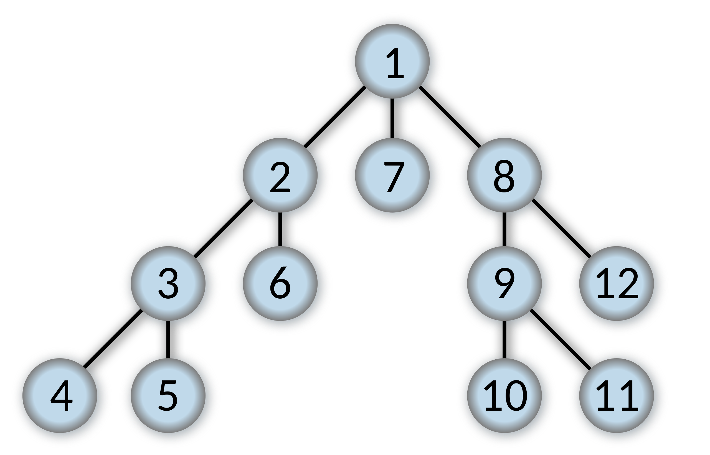

项目要求：[Project 1：Search CS 188: Introduction to Artificial Intelligence, Fall 2018 (berkeley.edu)](https://inst.eecs.berkeley.edu/~cs188/fa18/project1.html)

编辑内容仅限于`search.py`和`searchAgents.py`，需要阅读`pacman.py`,`game.py`和`util.py`。

/// details | Python版本要求3.6
由于判题脚本`autograder.py`的要求，Python环境应设置为3.6。
///

下面直接开始。

## problem类的几个常见方法
题目中大量使用了`getSuccessor`和`getStartState`，前者负责给出后继点信息，后者给出图的初始点，其输出为：

```python
(35, 1)
[((35, 2), 'North', 1), ((34, 1), 'West', 1)]
```
第一行是`start = getStartState()`的输出，就是一个点`start = (35,1)`，表示图中pacman的位置；

第二行是`getSuccessor(start)`的输出样例，给出了两个同构型元胞构成的列表，每个元胞分别由三个元素组成：（1）点`(x,y)`，即下个点的位置坐标；（2）action，表示为方向(东南西北)，表示从当前状态`start`出发到点`(x,y)`所需要执行的动作；（3）cost，即完成一步动作所支付的成本。
## Question 1 - DFS
> Finding a Fixed Food Dot using Depth First Search
> 利用深度优先搜索寻找一个固定位置的豆子

任务：实现`search.py`下的函数`depthFirstSearch(problem)`

实现过程：
首先，回顾DFS的思想。我们需要首先直到初始位置在哪，这不需要我们自行定义，而是调用该函数参数`problem`中的API，“getStartState”，不难理解。同时，DFS是一个先进后出的算法，因此需要一个栈，`util.py`已经为我们定义了这样的数据结构，然后，把出发状态`start`压进栈中。

> 这里传入栈中的是`(start, [])`元胞，第一项是当前状态位置，第二项指代的是path，即从start到该节点的路径，显然，start到start并不需要任何路径。

```python
start = problem.getStartState()  
stack = util.Stack()  
stack.push((start, []))
```

另外定义一个集合，用以存储那些已经探索过的节点：

```python
visited = set()
```

剩下的事情都是循环：
- 如果栈中最先拿出的（最后存入的）节点是目标节点，算法结束并传回结果——结果就是元胞`(node, path)`中的`path`
- 如果不是目标节点，则将其直接子节点加入栈中，重复以上目标。
- 如果不是目标节点且没有未探索过的直接子节点，则回退到上一级，表现为这个while循环中，从堆栈中将当前节点pop出来扔掉以外，什么都没发生，重新判断上层节点。
- 
```python
while not stack.isEmpty():  
    node, path = stack.pop()  
    if problem.isGoalState(node):  
        return path  
    if node not in visited:  
        visited.add(node)  
        for successor in problem.getSuccessors(node):  
		    stack.push((successor[0], path + [successor[1]]))
```

以下图的树为例（来自Wikipedia），来讲述搜索过程中的出入栈操作。假定我们要找的是节点4



1. 一开始，栈是空的，状态`start`是1，且`visited`列表是空的，表示没探索过任何节点。
2. 首先从当前的节点1开始，将该点及其路径`{1,[]}`压入栈。然后开始判断，又要把这个点pop出来，显然，节点1没有探索过，也不是目标节点，所以将1写入visited，表示已经探索过了，然后通过`getSuccessors`方法获取节点1的后续节点，即2、7、8。以节点2为例，实际获取的应当是`{2,[1,2]}`，既表示了2的名称，又写明了与初始节点1的路径关系。2、7、8同时被压入栈（栈中只有他仨），进入下一次的循环
3. 按照先进后出的原则，下一轮从stack.pop中读出的其实是节点8，但对于DFS来说，同一层级的节点先后顺序不重要，所以看起来是倒着来的。8不是目标节点，但也没有探索过，所以和第二步一样，将其写入`visited`，并压入其子节点9、12。现在栈中按顺序为2、7、9、12，下一轮判断12。
4. 12不是目标节点、没有（没有被评估过的）子节点，因此pop掉就pop掉了，栈中剩下2、7、9，下一轮评估9，与步骤2、3都一样。
5. 评估9，压入10、11；10、11分别评估后出栈，栈中只剩2、7。而8的所有子树都已评估过了，又回到了一级子节点。
6. 评估7，然后再评估2的那棵子树，就和前面的步骤一样，直到找到节点4，返回其路径`[1,2,3,4]`，算法结束。

## Question 2 - BFS

> Implement the breadth-first search (BFS) algorithm in the `breadthFirstSearch` function in `search.py`. Again, write a graph search algorithm that avoids expanding any already visited states. Test your code the same way you did for depth-first search.
> 
> 在`search.py`文件中的`breadthFirstSearch`函数中实现广度优先遍历（BFS）算法。一样的，写出避免评估任何已经评估过状态的图搜索算法，用与DFS题目一样的方式测试你的代码。

任务：实现图的广度优先遍历算法。

实现过程：
与DFS不同的是，BFS并不适合使用栈来实现，而是使用队列（queue），即先进先出的数据结构。与Stack一样，queue同样有push、pop操作，但是queue的push是将新数据插入到列表的最前面（索引0，而stack则是正常的append），从而queue每次pop出来的都是最后一项——第一个被push进去的数据。

除了stack/queue的区别外，DFS和BFS在实现中基本一致，先进先出保证了查完一层后才会进入到下一层——而下一层的子节点在本层各节点的遍历过程中被按顺序push进了queue中。

```python
def breadthFirstSearch(problem):  
    """Search the shallowest nodes in the search tree first."""  
    "*** YOUR CODE HERE ***"  
    start = problem.getStartState()  
    queue = util.Queue()  
    queue.push((start, []))  
    visited = set()  
    while not queue.isEmpty():  
        node, path = queue.pop()  
        if problem.isGoalState(node):  
            return path  
        if node not in visited:  
            visited.add(node)  
            for successor in problem.getSuccessors(node):  
			    queue.push((successor[0], path + [successor[1]]))
```

还是上面那张图，应该有如下顺序：
1-2-7-8-3-6-9-12-4-END

## Question 3 - 变换成本函数（统一成本搜索）
任务：在`search.py`的`uniformCostSearch`函数中实现Uniformed Cost Search。

UCS算是BFS的一种特例，采用的仍然是一种queue，但是出的顺序并非先进先出，而是有优先级“priority”。
### 特殊的队列：Priority Queue

首先讨论这种数据结构`priority queue`。其python实现为：

```python
class PriorityQueue:  
	def  __init__(self):  
        self.heap = []  
        self.count = 0  
  
    def push(self, item, priority):  
        entry = (priority, self.count, item)  
        heapq.heappush(self.heap, entry)  
        self.count += 1  
  
    def pop(self):  
        (_, _, item) = heapq.heappop(self.heap)  
        return item  
  
    def isEmpty(self):  
        return len(self.heap) == 0  
  
	def update(self, item, priority):   
	    for index, (p, c, i) in enumerate(self.heap):  
	        if i == item:  
	            if p <= priority:  
	                break  
	            del self.heap[index]  
	            self.heap.append((priority, c, item))  
	            heapq.heapify(self.heap)  
	            break  
		    else:  
		        self.push(item, priority)
```
相比于queue，PQ加入了一个heap（堆），并且多了一个`update`的方法。在使用`push`传入数据时，需要多传一个参数，即`priority`。例如在UCS的一开始，向queue传入的第一个参数就与BFS时不同，而是：
```python
queue.push((start, []), 0) #UCS
queue.push((start, [])) #BFS
```
数据仍然是那个数据，节点的位置、到这个节点的action序列，但是多了一个单独的参数，由于start到start没有行动，也不需要成本，所以priority是0。

而且，其`push`方法的实现也有较大的区别，它采用了heap方法，并调用了标准库`heapq`([heapq官方文档](https://docs.python.org/zh-cn/3/library/heapq.html))，其中使用了三个方法：

> 首先，heap本质上仍然是列表改。可以直接新建一个空列表建堆，也可以用`heapq.heapify()`将现有的非空列表改为堆。
> 
> - `heapq.heappush(heap,item)`。将`item`的值加入`heap`。
> - `heapq.heappop(heap)`。将`heap`中priority最小的元素pop出来。实际上，这相当于访问并删除`heap[0]`，因为heap会将priority最小的元素置于最前。
> - `heapq.heapity(x)`。将非空列表`x`转换为一个heap。

它多了一个`update`的方法，因为heap会被不断重建。
- 如果传入的item已经存在于现有的heap，但具有更高的priority，则更新其为更低的priority——删去heap中原有的item条目，将新的条目（新的priority）放进heap那个列表里，然后用heapify做排序，成为新的heap。
- 如果item已经存在且具有更低的priority，什么都不需要做。
- 如果item不存在于现在的heap中，则将其存入heap，并使用heappush来给item找到合适的位置。

### 回到题目
那其实，和BFS没什么大的区别，就是queue变成PriorityQueue，传入多一个priority，即路线的总成本：
```python
def uniformCostSearch(problem):  
    """Search the node of least total cost first."""  
    "*** YOUR CODE HERE ***"  
    start = problem.getStartState()  
    queue = util.PriorityQueue()  
    queue.push((start, []), 0)  
    visited = set()  
    while not queue.isEmpty():  
        node, path = queue.pop()  
        if problem.isGoalState(node):  
            return path  
        if node not in visited:  
            visited.add(node)  
            for successor in problem.getSuccessors(node):  
                queue.push((successor[0], path + [successor[1]]), problem.getCostOfActions(path + [successor[1]]))
```
对于非start-start路线，必然是有成本的，这个成本通过`getCostOfActions`方法来获取。


## Question 4 - Astar Search
从现在开始进入知情搜索（informed search）部分。第四题要求实现图模型上的Astar 搜索方法。

> Implement Astar graph search in the empty function `aStarSearch` in `search.py`. Astar takes a heuristic function as an argument. Heuristics take two arguments: a state in the search problem (the main argument), and the problem itself (for reference information). The `nullHeuristic` heuristic function in `search.py` is a trivial example.
> 
> 在`search.py`中的空函数`aStarSearch`中实现Astar 图搜索。Astar 需要获取一个启发函数作为实参。启发函数需要两个实参：主参数为搜索问题中的现有状态，并需要搜索问题本身提供参考信息。文件中给出的`nullHeuristic`函数是启发函数的平凡实例。

它可以被认为是UCS的进一步发展，唯一的改动在于priority的构成：
```python
def aStarSearch(problem, heuristic=nullHeuristic):  
    """Search the node that has the lowest combined cost and heuristic first."""  
    "*** YOUR CODE HERE ***"  
    start = problem.getStartState()  
    queue = util.PriorityQueue()  
    queue.push((start, []), 0)  
    visited = set()  
    while not queue.isEmpty():  
        node, path = queue.pop()  
        if problem.isGoalState(node):  
            return path  
        if node not in visited:  
            visited.add(node)  
            for successor in problem.getSuccessors(node):  
                queue.push((successor[0], path + [successor[1]]),  
                           problem.getCostOfActions(path + [successor[1]]) + heuristic(successor[0], problem))
```

打眼一看与UCS区别不大，都使用了priority queue，唯一的区别是多传入了一个方法`heuristic(node, problem)`，这是启发式方法和盲目搜索之间的本质区别。Astar 方法的priority不仅包含了当前节点与出发节点的成本（距离，也就是UCS里本就有的部分），还包括了“启发式动力”，即当前节点与目标节点的*估计前向成本*（estimated forward cost），这一部分由`heuristic`方法导入。前向成本的估计方法多种多样，是启发式方法的核心部分，常见的方式有曼哈顿距离（Manhattan Distance），即两点坐标各维度差的绝对值之和：

$$
\operatorname{ManDistance}(x_1,x_2,y_1,y_2) = |x_1 - x_2|+|y_1 - y_2| 
$$

```python
def manhattanHeuristic(position, problem, info={}):  
    "The Manhattan distance heuristic for a PositionSearchProblem"  
    xy1 = position  
    xy2 = problem.goal  
    return abs(xy1[0] - xy2[0]) + abs(xy1[1] - xy2[1])
```

另一种常见的启发式算法是贪心搜索（greedy search），它虽然也使用了priority queue，但其priority只考虑前向成本，而不考虑既有成本（即当前节点与出发节点的成本）。

/// details | 启发式函数只能低估，而绝不能高估行动的真实成本
    type: warning

参照Homework 1 Q7.3。假定有K个小虫子，走向各自不同的的K个目标点，而且虫子只能走华容道——不能互相交换也不能重叠，但每个时间点所有虫子都可以考虑移动一格。那么以下能作为启发式函数的是？

（1）Sum of Manhattan distances from each insect's location to its target location.每个虫子与其目标点的曼哈顿距离之和。**不可以**，假定所有虫子离目标点都只有一格，那么真实时间成本是1，而这种函数将返回$K$，高估了真实成本。

（2）Sum of costs of optimal paths for each insect to its goal if it were acting alone in the environment, unobstructed by the other insects.假定环境中只有一个虫子时，各自独立决策下的最优路径成本求和。**不可以**，原因同上。

（3）Number of insects that have not yet reached their target location.还没有到达目标点的虫子总数。**不可以**，原因同上。

（4）Max of Manhattan distances from each insect's location to its target location.各个虫子距离目标点的曼哈顿距离中的最大值。**可以**，因为真实成本一定不会小于离目标最远的虫子的距离（即便环境中只有那么一只虫子）。而且因为有多只虫子且会被阻挡，因此真实成本只可能比这更高，符合低估原则。

（5）Max of costs of optimal paths for each insect to its goal if it were acting alone in the environment, unobstructed by the other insects.假定环境中只有一个虫子时，虫子与目标点间最优路径的成本中的最大值。**可以**，原因同上。
///


## Question 5-6 Corner Problem
下面的两个问题进一步将图上搜索复杂化。考虑一个四角迷宫，每个角上有一个点。新的搜索问题是找到最短的路径，使得Pacman遍历四个角点（无论这个点上有没有豆子）。这种情况下，部分迷宫形式的最短路径并不见得是一开始就吃掉最近的豆子。

> Implement the `CornersProblem` search problem in `searchAgents.py`. You will need to choose a state representation that encodes all the information necessary to detect whether all four corners have been reached. 
> 
> 完成`searchAgents.py`中的`CornersProblem`类。您需要选择一种状态表示，对检测是否已到达所有四个角所需的所有信息进行编码。

在这两个题目中，要完成`class CornersProblem(search.SearchProblem):`中的内容，包括但不限于此问题下的`getStartState`方法、`isGoalState`方法、`getSuccessors`方法等。

### Question 5 - 问题的定义
```python
class CornersProblem(search.SearchProblem):  
    """  
    This search problem finds paths through all four corners of a layout.  
    You must select a suitable state space and successor function    """  
    def __init__(self, startingGameState):  
        """  
        Stores the walls, pacman's starting position and corners.        """        
        self.walls = startingGameState.getWalls()  
        self.startingPosition = startingGameState.getPacmanPosition()  
        top, right = self.walls.height-2, self.walls.width-2  
        self.corners = ((1,1), (1,top), (right, 1), (right, top))  
        for corner in self.corners:  
            if not startingGameState.hasFood(*corner):  
                print('Warning: no food in corner ' + str(corner))  
        self._expanded = 0 # DO NOT CHANGE; Number of search nodes expanded  
        # Please add any code here which you would like to use   
        # in initializing the problem        
        "*** YOUR CODE HERE ***"  
  
    def getStartState(self):  
        """  
        Returns the start state (in your state space, not the full Pacman state        
        space)        
        """        
        "*** YOUR CODE HERE ***"  
        return self.startingPosition, tuple()  
  
    def isGoalState(self, state):  
        """  
        Returns whether this search state is a goal state of the problem.        
        """        
        "*** YOUR CODE HERE ***"  
        return len(state[1]) == 4  
  
  
    def getSuccessors(self, state):  
        """  
        Returns successor states, the actions they require, and a cost of 1.  
         As noted in search.py:            
         For a given state, this should return a list of triples, (successor,            
         action, stepCost), where 'successor' is a successor to the current            
         state, 'action' is the action required to get there, and 'stepCost'            
         is the incremental cost of expanding to that successor    
         """  
        successors = []  
        for action in [Directions.NORTH, Directions.SOUTH, Directions.EAST, Directions.WEST]:  
            # Add a successor state to the successor list if the action is legal  
            # Here's a code snippet for figuring out whether a new position hits a wall:
            #   x,y = currentPosition            
            #   dx, dy = Actions.directionToVector(action)         
            #   nextx, nexty = int(x + dx), int(y + dy)            
            #   hitsWall = self.walls[nextx][nexty]  
            "*** YOUR CODE HERE ***"  
            currentPosition, corners = state  
            x, y = currentPosition  
            dx, dy = Actions.directionToVector(action)  
            nextx, nexty = int(x + dx), int(y + dy)  
            hitsWall = self.walls[nextx][nexty]  
            if not hitsWall:  
                nextPosition = (nextx, nexty)  
                nextCorners = tuple(corner for corner in self.corners if corner not in corners and corner == nextPosition or corner in corners)  
                successors.append(((nextPosition, nextCorners), action, 1))  
        return successors  
  
  
        self._expanded += 1 # DO NOT CHANGE  
        return successors  
  
    def getCostOfActions(self, actions):  
        """  
        Returns the cost of a particular sequence of actions.  If those actions        
        include an illegal move, return 999999.  This is implemented for you.        
        """        
        if actions == None: return 999999  
        x,y= self.startingPosition  
        for action in actions:  
            dx, dy = Actions.directionToVector(action)  
            x, y = int(x + dx), int(y + dy)  
            if self.walls[x][y]: return 999999  
        return len(actions)
```

其中`__init__`和`getCostOfActions`无需修改。其实没有想象中复杂，就是重新定义一下目标——我们的目标不再是特定的state位置，而是走过角点的计数，体现在代码里，就是查询state时额外加入的tuple`corners`，它存储了已经走过的角落的位置信息，我们需要的也不是它的位置，而是这个tuple的长度：

```python
def isGoalState(self, state):  
	"""  
	Returns whether this search state is a goal state of the problem.        
	"""
	return len(state[1]) == 4  
```

最关键的还是`getSuccessors`方法的构造。其实也不困难，因为这里不涉及到任何搜索方法，只需要在当前节点基础上，找到可行动作——不撞墙就行，然后把它压进successor列表里返回给搜索算法。

如果动作可行——没有撞上墙，那么就把动作后的位置、动作后踩过的corner集合`nextcorners`写出来，然后按照给定的数据结构：`((nextState, nextCorners), action, cost)`返回给算法，cost给定为1即可，这里不涉及启发式问题。

### Question 6 - 启发函数
> Implement a non-trivial, consistent heuristic for the `CornersProblem` in `cornersHeuristic`.
> 
> 在`cornersHeuristic`空方法里实现一个非平凡的，一致的启发式函数。

最简单的就是同时计算与尚未踩到的各个角的Manhattan距离，取最大值(**不可以取总和，原因在前面的Ques 4**)。
```python
def cornersHeuristic(state, problem):  
	corners = problem.corners # These are the corner coordinates  
    walls = problem.walls # These are the walls of the maze, as a Grid (game.py)  
    "*** YOUR CODE HERE ***"  
    totalDistance = []  
    for corner in corners:  
        if corner not in state[1]:  
            totalDistance.append(util.manhattanDistance(state[0], corner))  
    if len(totalDistance) == 0:  
        return 0  
    else:  
        return max(totalDistance)
```

这样就能拿满这道题的分数了。

## Question 7 - 吃光所有豆
将目光转移到`FoodSearchProblem`类上。用尽可能少的步骤吃光地图上所有的豆子。此时的state变成了：

```python
position, foodGrid = state
```

其中`foodGrid`表示一个和迷宫地图大小相同的Boolean矩阵，当对应点上存在豆子时赋True，否则为False。那么我们遍历每一个为True的点，然后调用`MazeDistance`函数来获取当前位置与各豆子的图上距离，并选取其中的最大值——和上一题一样。

```python
def foodHeuristic(state, problem):  
    position, foodGrid = state  
    "*** YOUR CODE HERE ***"  
    foodList = foodGrid.asList()  
    max_distance = 0  
    for food in foodList:  
        distance = mazeDistance(position, food, problem.startingGameState)  
        if distance > max_distance:  
            max_distance = distance  
    return max_distance
```

采用该启发式函数可以获取该题目的bonus grade（5/4），因为展开节点的子节点树的次数（number of nodes expanded）小于7000。
## Question 8 - 次优解
任务：

1. 修改`findPathToClosestDot`方法

2. 修改`AnyFoodSearchProblem`类中的`isGoalState`方法。

首先要补上任务2的内容，这个问题没有给出判别目标状态的方法：
```python
def isGoalState(self, state):
	x,y = state

	"*** YOUR CODE HERE ***"
	return (x,y) in self.food.asList()
```

其实问题本身只告诉你要做任务1，但是其中引用了`AnyFoodSearchProblem`问题，即随便吃一个地图中的豆的问题，所以要补。再者说，这里也没要求最优解，次优解即可，吃哪个豆都无所谓。

进一步，回到任务1，为了尽量使找到的豆离当前位置最近，要用什么搜索方法？答案是BFS，因为它会一层一层的探索，只有第$i$层子节点找不到目标状态才去下一层，具象在地图上，就是不扫清楚离当前节点距离为$i$的所有格子，它不回去找距离为$i+1$的格子。

```python
def findPathToClosestDot(self, gameState):  
    startPosition = gameState.getPacmanPosition()  
    food = gameState.getFood()  
    walls = gameState.getWalls()  
    problem = AnyFoodSearchProblem(gameState)  
  
    "*** YOUR CODE HERE ***"  
    return search.bfs(problem)
```

至此，Project 1内容结束，按照题头的指引，在shell中运行：
```powershell
python autograder.py
```
来获取各题目的本地评分。