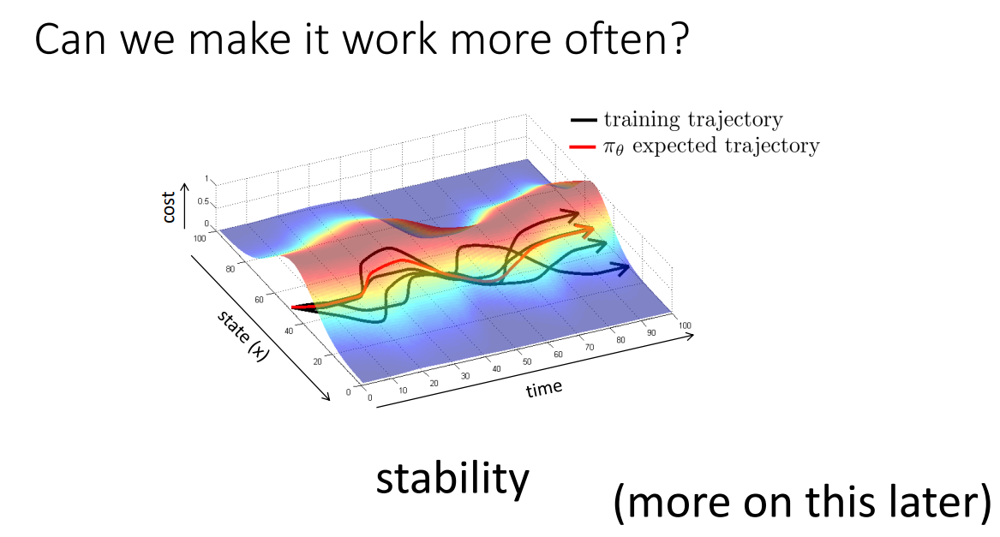
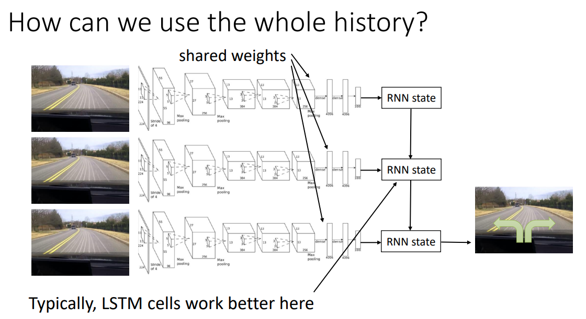
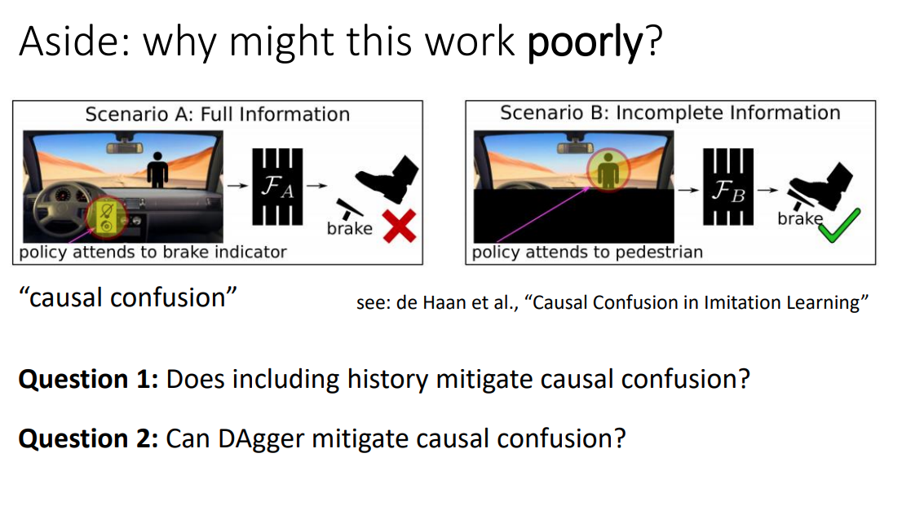

# 对动作的有监督学习

对应CS285 Lecture 2

## 1. 概念和预备知识

首先说明DRL下需要的核心概念：状态（state），观测（observation），动作（action），策略（policy）。状态是最底层的，但可能纷繁复杂，而且未必对agent可见。因此由状态产生了观测，agent通过学习对已知观测和动作产生了映射关系：

$$
\pi_\theta (a_t, \mid o_t)
$$

从而有了不完全观测下的agent策略；如果是完全可观测，则就有$\pi_{\theta}(a_t\mid s_t)$，直接用状态替换掉观测。

/// admonition | Observation vs. State
    type: note

以CS285的lecture slide为例，它给出了一个猎豹(cheetah)追逐瞪羚(gazelle)的图片：我们的观测是这张图片，而实际的状态——或者说和我们做学习有关的状态则是猎豹和羚羊在前后、左右、上下三个方向上的运动速度。

而抽象一些来说，状态就是环境的实际情况，而观测则是由状态产生，但并不一定能推出状态全部信息的内容，见下图（CS285 Lecture 2 第3页）

而且，状态一定满足马尔可夫性（已知$s_t$时，$s_1,...,s_{t-1}$没有用处），但观测不一定服从马尔可夫性。例如，在观测点和猎豹之间有一辆车，完整地挡住了猎豹，那猎豹和瞪羚仍在追逐，但观测者无法得知猎豹的情况，并在不借助既往信息的情况下预测未来。所以，利用观测做决策时，一般会同时参照既往的观测。
///

/// details | 逸闻：关于符号系统的差异
    type: info

强化相关领域有两套符号系统。其中，一套是前面提到的$s_t, a_t$，它由美国动态规划领域专家理查德·贝尔曼（Richard Bellman）提出。

另一套则是$x_t, u_t$，前者代表状态，用$x$的原因是它常代表未知数；后者代表动作，来自俄语单词"управление"(latin: upravlenie，操纵、控制、（行政）管理（及其机关）、指挥)的首字母，这一套符号系统来自苏联自动控制领域专家列夫·庞特里亚金(Лев Семёнович Понтрягин, Lev S. Pontryagin)
///

然后聊一下强化学习和监督学习之间的区别。

有监督学习给定了一套观测集$\mathcal{D}\{(x_i,y_i)\}$，进而通过$x_i$来预测$y_i$。在这个过程中，通常假定数据独立同分布，并且知道训练集的真实标签$y_i$。

但强化学习不假定数据独立同分布——之前的输出会影响未来的输入；即便是训练集也不知道准确的标签，而只能获得reward。

## 2.模仿学习(imitation learning)

本质上，模仿学习不是强化学习，而是监督学习。

以上图为例，模仿学习是从过程中拿到$o_t, a_t$作为训练数据，进而通过有监督学习来学习$\pi_\theta(a_t \mid o_t)$，获取参数化的策略函数。那么这玩意能有用吗？没有。

因为训练集和实际采取策略并产生的数据就不是一套分布。黑曲线(training trajectory)是训练agent的训练集数据分布，而红线($\pi_\theta$ expected)是agent所作动作后新生成的数据。前者没有前后关系，后者有前后因果关系，因此随着时间流逝，两者之差累积增大。
/// admonition | Big mistake
    type: warning

在时间初期，红黑线是比较接近的，但是会慢慢地出现一些误差，导致模仿学习策略在现实环境中进入了一些以前从未见过的状态中，并进而导致了其决策失效——然后出现更大的mistake。因此，从这张图上能看出来，随着时间的增大，红线与理想化的黑线之间具有总体越来越大（可能变小但逐渐不可控）的差异。
///

怎么解决呢？总体的思路是，尽管黑线（观测）是有随机的，但总体来说应该有一个分布存在，这个分布是来自于一个可控的机制，所以分布内的黑线是受到这个机制的控制并进行纠偏的。对应的，我们可以考虑一些启发式的方法，在更大的采样范围内改进模仿学习：

用更加数学化的方式来表示，我们的采样（黑线）是观测的$o_t, a_t$对，那么$o_t$就有一个样本集的概率分布，我们称之为$p_{data}(o_t)$，显然$o_t$分布不是独立的。我们用采样来训练策略$\pi_\theta(a_t \mid o_t)$，训练得到的过程也能观测到一个$o_t$的分布，我们称之为$p_{\pi_\theta}(o_t)$。 那么，改进学习过程，并强制$p_{\pi_\theta}(o_t) = p_{data}(o_t)$，会是一种方法。即DAgger：通过agent产生的动作产生一些数据$o_t$，并将这些生成的数据加回到数据集中。

/// admonition | DAgger
    type: example

目的：从$p_{\pi_\theta}(o_t)$中获取训练数据

怎么做：不断地跑$\pi_\theta (a_t \mid o_t)$，但这需要对应的$a_t$（这不是以前现成的模仿数据，而是随做随学），下面的内容不断循环：

1. 通过人类行为数据集$\mathcal{D}=(o_1,a_1,...,o_N,a_N)$，训练$\pi_\theta (a_t \mid o_t)$;
2. 运行$\pi_\theta (a_t \mid o_t)$来获取$\mathcal{D}_{\pi} (o_1,...,o_M)$;
3. 人工标注$\mathcal{D}_\pi$中的每一个观测——给出对应动作$a_t$;
4. 将新数据注入训练集$\mathcal{D} \leftarrow \mathcal{D} \cup \mathcal{D}_\pi$

Ross et.al. (2011) 证明了DAgger在大量反复观测和获取新训练集数据的情况下，DAgger得到的训练集分布将渐近等同于实际的策略后状态分布。

> Ross, S., Gordon, G., & Bagnell, D. (2011, June). A reduction of imitation learning and structured prediction to no-regret online learning. In *Proceedings of the fourteenth international conference on artificial intelligence and statistics* (pp. 627-635). JMLR Workshop and Conference Proceedings.

///

### 实践中的深度模仿学习 - 问题

DAgger的问题是什么？人工，我要找大量的标注人，这是一个很枯燥而复杂的问题，而且很多的state是让人很不舒服的。例如，你不能让标注员去讨论如果一辆车已经飞出悬崖，他应该怎么做。

但是，如果不使用额外数据，DAgger或者深度模仿学习能解决前面的问题吗？理论上讲是不可以的。

- 如果模型非常好，不会出现分布的漂移，也不会出现误差的利滚利，那么DAgger就没必要用了
- 如果不能，那么就必须要非常好地拟合专家行为，但这几乎不可能
- 以及，不能过拟合！

那么，为什么很难很好地拟合专家行为呢？主要来自于两个问题：

**（一） 非马尔可夫行为**

马尔可夫性假定当前的行为来自当前的观测——那么连续给出两次相同观测的结果是两个相同的行为，但显然对于人类来说非常不自然。人类的行为是有限理性的，而且有延迟，而且人类做出决策的过程是关于当前环境的，那么人类不会$\pi_{\theta}(a_t \mid o_t)$，而是$\pi_\theta(a_t \mid o_1,...,o_t)$，即考虑更久远的观测。
/// admonition | 引入全部观测历史的副作用
    type: warning
这个东西在DeepMind的讲座中也提及了，不过Hasselt站在非深度强化学习模型的角度上，只提了全历史数据集会非常大，从而导致计算复杂度的问题；而Levine提到了另一个问题，即站在DRL的角度上，全量历史（时间跨度大、$o_t$包含图片等高体积信息）可能会导致神经网络的第一层在整个系统中具有极高的权重，从而导致过拟合。
///
但这里不是说我们不用全量历史了，而是聚焦于后一个问题（因为自动驾驶不用图片也不行，计算复杂度就随他去吧）。为了解决第一层过大的问题，可以采用RNN的方式解决，各期历史共享一套图片encoder的权重，然后在最后加入一套例如LSTM的递归神经网络。

/// details | 很多模型在模仿学习中翻车的原因
    type: note

参照下图，这是一个自动驾驶中碰到行人急刹车的例子，但我们用的是模仿学习。

我们为其提供了全量历史，观测的内容是挡风玻璃外的前景和仪表盘。按理说前面有行人，摄像头拍到了就应该刹车，但模型偏不。为什么呢？在模仿学习过程中，模型不光看到了踩刹车时前面有个人，而且还看到了仪表盘上刹车灯亮了。

结果就是，模型认为，踩刹车的条件不是前面有个人，而是仪表盘上刹车灯亮了......

怎么解决呢，我们把仪表盘盖住不让它看，再训练的时候就行了。

这种模型倒果为因的现象一般被称作“Causal Confusion”，参见de Hann et. al. (2019)的工作：

De Haan, P., Jayaraman, D., & Levine, S. (2019). Causal confusion in imitation learning. *Advances in Neural Information Processing Systems*, 32.
///

**（二）多模态行为**

例如，飞行问题中发现前面有一棵树，我想让无人机绕过去，那么往左飞往右飞都可以，但我不好取舍，那平均一下，就撞树上了。

这种事发生的原理在于模拟学习策略对$\pi_\theta(a_t \mid o_t = o)$(假如$o$代表飞行器前面有棵树)的学习是基于现实专家数据的MLE，而专家数据表示一半往左一半往右，那么策略最后拟合出来的未必是$p(a = L) = p(a = R) = 0.5, p(a = c) = 0$，而是一个$a \in \{l,c,r\}$的正态分布，而且PDF的峰值出现在了$c$上。

### 解决这些问题的探索

- 不用单一分布，而是采用多个正态分布的组合，最好实现
- 用一些隐变量模型(latent variable models)，最难
- 自回归离散化 (autoregressive discretization)，前两者的trade-off

**（一）混合分布**

绝对意义上的傻大黑粗，其原理非常简单：

$$
\pi (a \mid o) = \sum_i w_i \mathcal{N} (\mu_i, \Sigma_i)
$$

假设有$N$个正态分布做混合，那就得输出N组$\{w_i, \mu_i, \Sigma_i\}$的元胞，这使得策略地表达变得复杂了很多，尤其对动作空间非常复杂的模型非常不友好，但确实好使。

**（二）隐变量模型**

训练难度最大的模型，其思路不是改变模型的输出，而是改变模型的输入。

其训练的方法之后会讲，通常包括：

1. 条件变分自编码 conditional variational autoencoder
2. 正态流 Normalizing flow
3. Stein变分梯度下降法 Stein variational gradient descent

**(三)自回归离散化**

如果动作空间的维度很低（action set的选项很多，乃至于连续action都可以），那么就可以通过自回归离散化方式把动作空间变成离散的。对于一维空间，我可以轻松地将其变成少数$k$个action，但对于高维空间，这种方法的复杂度会迅速提升,$n$维动作空间，每个维度分$k$个离散动作将导致出现$k^n$个动作，因此不太实际。不过，我们可以在神经网络的结构上动刀，在相对低维的情况下，一次只离散化一个维度并训练。

## 3. 模仿学习的问题？
CS285不叫“深度模仿学习”，而是“深度强化学习”，显然模仿学习，以及其他的对动作策略的无监督学习存在一些严重的缺陷。

1. 首当其冲的是，模仿学习需要所有的数据都由人来编写和选择，这导致数据量可能比较少——但有监督的深度学习需要大量的数据。
2. 人有时候很难提供各种动作。简单的情况是，人不会飞，也不想在林子里跑，就算人会控制无人机，但人也很难控制无人机里某个电路的电压，或者同时操纵无人机动作的各个自由度。
3. 就不能让机器自己去学？这顺道把第一个问题也解决了。
4. 随着模型期数的增长，发生错误的次数会逐渐增大（最好的情况也不过线性增长），具体见下一段。

## 4. 模仿学习中的收益或成本函数，及其形式化表达

最后聊一点理论的东西

我们回到刚开始的问题，碰到了一头狮子，人肯定会跑，跑的原因不是因为看到了以前人都跑，而是自己脑子里就在不断想象不跑被狮子吃掉的情景。被狮子吃掉可以理解为某种cost（当然是正无穷，但在很多问题中cost是有限的）。那么我们可以说agent的问题可以被表示为某种程度上的cost minimization:

$$
\min_{\theta} E_{s_{1:T}, a_{1:T}} \sum_t c(s_t,a_t)
$$

其中状态$s_t$服从动态的分布，即unstationary distribution，分布随着时间变化；而动作$a_t$的分布跟着状态走，也是一种unstationary的情况。

> 当然，也可以反过来，最大化reward，都一样。不过，RL更倾向于reward，而自动控制理论更习惯于cost。

那么，在模仿学习中，我可以有以下两种（也可以有其他很多种）reward或cost函数，第一种是log likelihood，即$r(s,a) = \log p(a = \pi^{*}(s) \mid s)$，即当前状态$s$下做出最优决策的概率的对数；另一种是二元的0-1变量：

$$
c(s,a) = \left\{\begin{array}{ll}
0\quad & \text{if } a = \pi^{*}(s)\\
1\quad & \text{otherwise} 
\end{array} \right.
$$

如果选出了最优决策就没有cost，否则cost加一。那么，DAgger能将这个imitation learning优化成什么样？

为了说明这个问题，这里首先用一种相对简便的假设：假定$\pi_\theta (a \not = \pi^{*}(s) \mid s) \leq \epsilon$对任意$s \in \mathcal{D}_{\text{train}}$成立。这句话的意思是，对于任意出现在训练集中的状态$s$，在这种状态下选取非最优动作的概率不高于上界$\epsilon$。

那么，对于一个Imitation learner，共有$T$期动作的情况下，其Cost Function将如此表示：

$$
E[\sum_t c(s_t, a_t)] \leq \epsilon T + (1-\epsilon) [\epsilon(T-1)+ (1-\epsilon) [...]]
$$

这么写的原因很简单，只要做错一次，就再也无法修正回来了。接下来证明$E[\sum_t c] \in O(\epsilon T^2)$，即其最大不超过$\epsilon T^2$。不过在这里，之前那个$\forall s \in \mathcal{D}_{\text{train}}$的假设就要扩展为更一般的条件，即策略不仅在训练集中出现过的state能做好，而且也能外推到其他的state。换句话说，假设改成：

$E_{p_{\text{train}}(s)} \pi_\theta (a \not = \pi^{*}(s) \mid s) \leq \epsilon$对 $\forall s \in p_{\text{train}}(s)$成立，state的分布来自于训练集。

> 如果模仿学习中采用了DAgger，则有$p_{\text{train}}(s) \to p_{\theta}(s)$，这使得每次决策错误都有挽回的余地，那么有$E[\sum_t c(s_t, a_t)] \leq \epsilon T$，期望变成了线性关系。

如果不用DAgger，那么就是一个比较难的问题，因为$p_{\text{train}}(s) \not =  p_{\theta}(s)$，我们先把拟合出来的状态分布$p_{\theta} (s_t)写成两项：第一项是训练集训练出来的完全没走错的情况，第二项是出现了错误的情况：

$$
p_\theta(s_t) = (1-\epsilon)^t p_{\text{train}} (s_t) + (1-(1-\epsilon)^t) p_{\text{mistake}}(s_t)
$$

第一项我们清楚，但第二项未知也不可能知道。所以我们能做的是衡量$p_\theta$和$p_{\text{train}}$的差：

$$
|p_\theta(s_t) - p_{\text{train}}(s_t)| = (1-(1-\epsilon)^t) |p_{\text{mistake}} - p_{\text{train}}| \leq 2(1-(1-\epsilon)^t) \leq 2 \epsilon t
$$

设想最坏的情况，$p_{\text{mistake}} = 1, p_{\text{train}} = 0$，则这个值最大为$(1-(1-\epsilon)^t)$，但我们可以将其放得更大，它一定不大于$2(1-(1-\epsilon)^t)$。而对于$\epsilon \in [0,1], t \in [0,\infty)$，一定有$1-(1-\epsilon)^t \leq \epsilon t$，故上面的两步放缩成立。
> 本来以为这个2有什么深意，最后发现是Sergey随便设的。

那么，采用这种学习定式的agent，所采取动作的平均错误数为：

$$
\begin{align}
\sum_t\mathbb{E}_{p_\theta(s_t)}[c_t] &= \sum_t\sum_{s_t}p_\theta(s_t)c_t(s_t)\\
&\leq\sum_t\sum_{s_t}p_{train}(s_t)c_t(s_t)+|p_\theta(s_t)-p_{train}(s_t)| \cdot c_{max}\\
&\leq\sum_t\epsilon+2\epsilon t\\
&\in O(\epsilon T^2)
\end{align}
$$ 

第一行到第二行是拆$p_\theta$，第一项是训练集里我们知道的数据，第二项是我们不知道的数据，那我们就考虑最坏情况——全错，$c_{\max} = 1$!

第二行到第三行中，第二项是第二行第二项的进一步放缩，这应用了前面放缩的结论。第一项是假设中的错误概率上限，也是不等式。

$$
\sum_{s_t} p_{\text{train}} (s_t) c_t(s_t) \leq \sum_{s_t} p_{\text{train}} (s_t) \epsilon = \epsilon
$$

第三行的值等于$\epsilon T + 2 \epsilon T^2$，那么引用算法里大$O$的概念，这个错误的上限不大于$\epsilon T^2$这个数量级，所以Sergey这个2设成几都无所谓了。而如果用了DAgger，因为没有了$p_{\text{mistake}}$的情况，其期望错误数就是$O(\epsilon T)$这个量级了。同时，我们可以看到，随着模型总时长设定的加大，模仿学习策略出的错误会越来越多——不过是线性增长还是二次函数增长的区别罢了，这是模仿学习的根本症结之一，也是我们学习强化学习而不是模仿学习的原因。

## 5. 关于作业
作业会单独的作为一个网页挂出来，见[作业一、模仿学习](https://yliu-fe.github.io/Majors/Reinforcement%20Learning/CS285/HW1_Imitation%20Learning/)。

但在领略CS285这门课噩梦般的作业前，还要学习CS285的Lecture 3，这部分是助教领着上PyTorch的教程课，这部分内容不会出笔记。

CS285 Fall 2021（最近一个有课程录像的学期）的网站上没有给出Lecture 3的演示文稿，我贴一下这一期课程所用Jupyter Notebook的Google Colab链接：[CS 285 Fa21 PyTorch Tutorial](https://colab.research.google.com/drive/135fzWzVf4IULsr68RUoShV-ZDTzXKvbp?usp=sharing)。