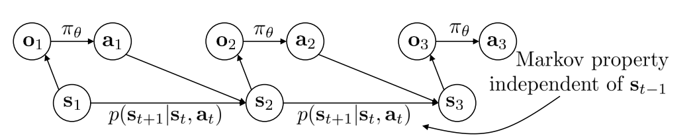
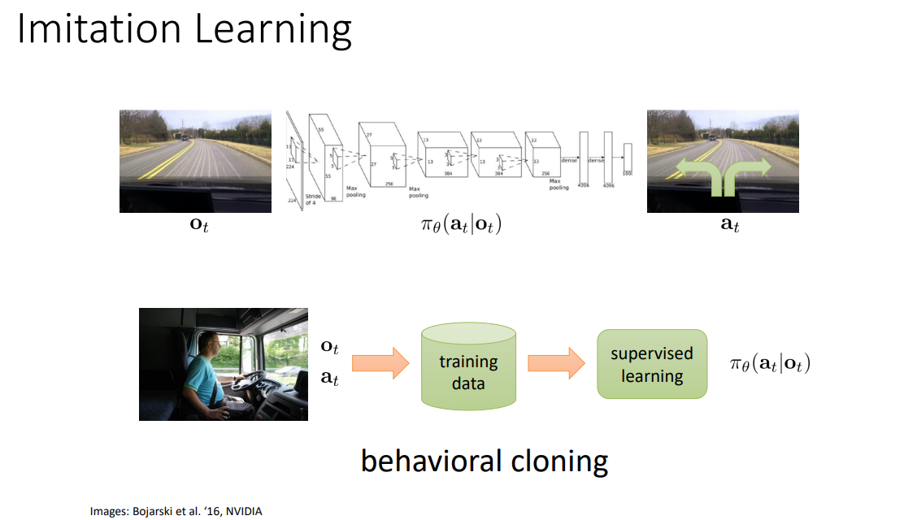
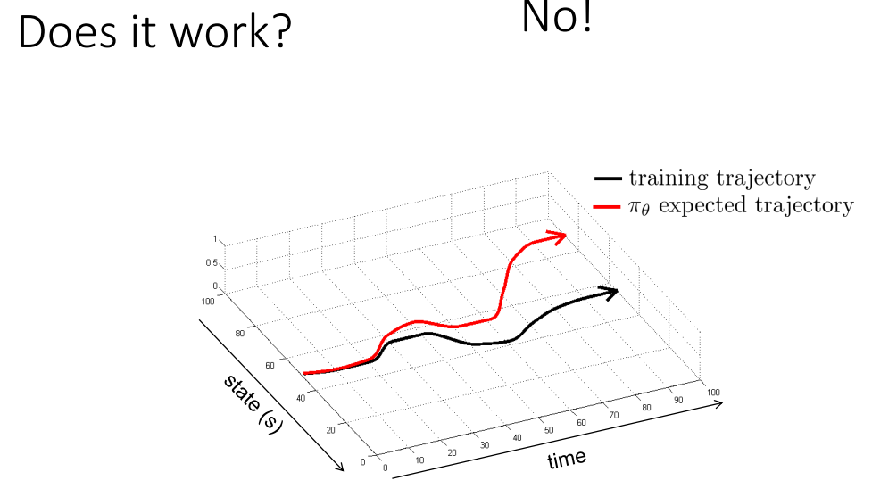

# 对动作的有监督学习

对应CS285 Lecture 2

## 1. 概念和预备知识

首先说明DRL下需要的核心概念：状态（state），观测（observation），动作（action），策略（policy）。状态是最底层的，但可能纷繁复杂，而且未必对agent可见。因此由状态产生了观测，agent通过学习对已知观测和动作产生了映射关系：

$$
\pi_\theta (a_t, \mid o_t)
$$

从而有了不完全观测下的agent策略；如果是完全可观测，则就有$\pi_{\theta}(a_t\mid s_t)$，直接用状态替换掉观测。

/// admonition | Observation vs. State
    type: note

以CS285的lecture slide为例，它给出了一个猎豹(cheetah)追逐瞪羚(gazelle)的图片：我们的观测是这张图片，而实际的状态——或者说和我们做学习有关的状态则是猎豹和羚羊在前后、左右、上下三个方向上的运动速度。

而抽象一些来说，状态就是环境的实际情况，而观测则是由状态产生，但并不一定能推出状态全部信息的内容，见下图（CS285 Lecture 2 第3页）

而且，状态一定满足马尔可夫性（已知$s_t$时，$s_1,...,s_{t-1}$没有用处），但观测不一定服从马尔可夫性。例如，在观测点和猎豹之间有一辆车，完整地挡住了猎豹，那猎豹和瞪羚仍在追逐，但观测者无法得知猎豹的情况，并在不借助既往信息的情况下预测未来。所以，利用观测做决策时，一般会同时参照既往的观测。
///

/// details | 逸闻：关于符号系统的差异
    type: info

强化相关领域有两套符号系统。其中，一套是前面提到的$s_t, a_t$，它由Richard Bellman提出。

另一套则是$x_t, u_t$，前者代表状态，用$x$的原因是它常代表未知数；后者代表动作，来自俄语单词"управление"(“动作”，latin: upravlenie)的首字母，这一套符号系统来自苏联自动控制领域专家列夫·庞特里亚金(Лев Семёнович Понтрягин, Lev S. Pontryagin)
///

然后聊一下强化学习和监督学习之间的区别。

有监督学习给定了一套观测集$\mathcal{D}\{(x_i,y_i)\}$，进而通过$x_i$来预测$y_i$。在这个过程中，通常假定数据独立同分布，并且知道训练集的真实标签$y_i$。

但强化学习不假定数据独立同分布——之前的输出会影响未来的输入；即便是训练集也不知道准确的标签，而只能获得reward。

## 2.模仿学习(imitation learning)

本质上，模仿学习不是强化学习，而是监督学习。

以上图为例，模仿学习是从过程中拿到$o_t, a_t$作为训练数据，进而通过有监督学习来学习$\pi_\theta(a_t \mid o_t)$，获取参数化的策略函数。那么这玩意能有用吗？没有。

因为训练集和实际采取策略并产生的数据就不是一套分布。黑曲线(training trajectory)是训练agent的训练集数据分布，而红线($\pi_\theta$ expected)是agent所作动作后新生成的数据。前者没有前后关系，后者有前后因果关系，因此随着时间流逝，两者之差累积增大。怎么解决呢？让$p_{\text{data}}$来不断近似$p_{\pi_\theta}$，即DAgger：通过agent产生的动作产生一些数据$o_t$，并将这些生成的数据加回到数据集中。

/// admonition | DAgger
    type: example

目的：从$p_{\pi_\theta}(o_t)$中获取训练数据

怎么做：不断地跑$\pi_\theta (a_t \mid o_t)$，但这需要对应的$a_t$（这不是以前现成的模仿数据，而是随做随学），下面的内容不断循环：

1. 通过人类行为数据集$\mathcal{D}=(o_1,a_1,...,o_N,a_N)$，训练$\pi_\theta (a_t \mid o_t)$;
2. 运行$\pi_\theta (a_t \mid o_t)$来获取$\mathcal{D}_{\pi} (o_1,...,o_M)$;
3. 人工标注$\mathcal{D}_\pi$中的每一个观测——给出对应动作$a_t$;
4. 将新数据注入训练集$\mathcal{D} \leftarrow \mathcal{D} \cup \mathcal{D}_\pi$

Ross et.al. (2011) 证明了DAgger在大量反复观测和获取新训练集数据的情况下，DAgger得到的训练集分布将渐近等同于实际的策略后状态分布。
> Ross, S., Gordon, G., & Bagnell, D. (2011, June). A reduction of imitation learning and structured prediction to no-regret online learning. In *Proceedings of the fourteenth international conference on artificial intelligence and statistics* (pp. 627-635). JMLR Workshop and Conference Proceedings.
///

### 实践中的深度模仿学习