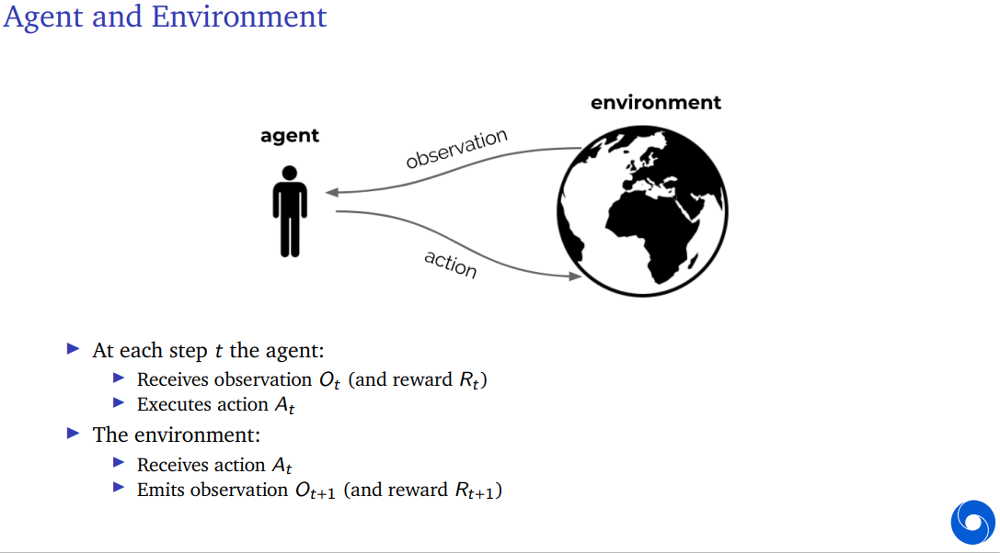
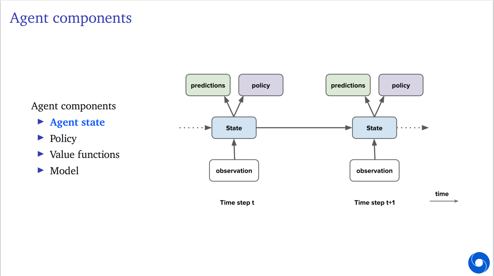

# 强化学习的介绍——问题的形式化表达

对应Deepmind 2021第一讲。

视频地址：[DeepMind x UCL RL Lecture Series - Introduction to Reinforcement Learning [1/13]](https://www.youtube.com/watch?v=TCCjZe0y4Qc&ab_channel=DeepMind)

演示文稿：[Reinforcement Learning Lecture 1: Introduction ](https://storage.googleapis.com/deepmind-media/UCL%20x%20DeepMind%202021/Lecture%201%20-%20introduction.pdf)

讲授人：Hado van Hasselt

## 0. 前言

强化学习是什么？

> Science and framework of **learning to make decisions** from **interaction**

要求我们考虑什么？

> - 时间 time
> - 动作的长期结果 (long-term) consequences of actions
> - 主动地积累经验 actively gathering experience
> - 预测未来 predicting the future
> - 处理不确定性 dealing with uncertainty

同时，强化学习问题是人工智能问题的结构化表达，且拥有巨大的可能性(huge potential scope)。

## 1. 强化学习问题的形式化表达

/// admonition | 离散化时间假定
    type: warning

此课程不讨论连续时间强化学习，并假定时间戳$t$为离散的：$t = 1,2,...$
///

强化学习本质上是一种交互，即行为人（以下称"agent"）与环境间的交互。

（该图片位于该课程演示文稿的第21页）

在学习过程中，行为人与环境循环交互，在时间点$t$，其内容如下：
/// admonition | Agents <-> Environment
    type: note

行为人将：

- 从环境处**观测**$O_t$（在全观测模型下，可以直接写为**状态**$S_t$）和**收益**$R_t$。
- 执行（向环境发送）**动作**$A_t$

环境将：

- 从行为人处获取动作$A_t$
- 生成观测$O_{t+1}$和收益$R_{t+1}$

其中，“观测”,“状态”,“收益”,“动作”分别对应英文名词*observation, state, reward, action*
///

### a. 收益和价值 reward & value

收益$R_t$是一个标量，或者说，一个数。它表示的是行为人在第$t$期的动作带来的好处，而强化学习正是建立在收益假设(*reward hypothesis*)之上：

> Any goal can be formalized as the outcome of maximizing a cumulative reward.
>
> 一切目标都被形式化为最大化累计收益策略带来的结果。

基于这个假设，站在第$t$期来看，行为人所做的一切都是为了最大化**未来的**累计收益：

$$
G_t = R_{t+1} + R_{t+2} + R_{t+3} + ...
$$

其中，我们称$G_t$为站在第$t$期往后看的**回报**(*return*)，它代表了之后所有收益的总值（或之后会讲到的，加入折现因子后的，净现值之和）。

显然，$G_t$并不是一个确切的值——观测不同、动作不同，得到的$G_t$很可能不同。那么，我们定义**价值**(*value*) 函数$v(s)$，代表当状态$S_t = s$时，未来回报的期望，即：

$$
\begin{align}
v(s) &= \mathbb{E} \{G_t \mid S_t = s\}\\
&= \mathbb{E} \{R_{t+1} + R_{t+2} + ... \mid S_t = s\}
\end{align}
$$

价值函数也不是确定的，因为还有一个变量没有控制，即行为人做出的决策$A_t$，这也是我们的优化目标。现在我们知道，agent要做的事是选择一个合适的$A_t$，来最大化当前状态下的价值函数$v(s)$。同时，收益和价值共同定义了状态和动作的**效用**(*utility*)，这是一个经济学学生熟悉的概念，这不是一个监督型学习中的反馈，而是*这个行为和那个行为在这个状态或那个状态当中执行所得到的回报和价值*，只有高低之分，没有对错之别。

进一步，我们可以将其写成递归的形式：

$$
\begin{align}
G_t &= R_{t+1} + G_{t+1}\\
v(s) &= \mathbb{E}\{R_{t+1} + v(S_{t+1}) \mid S_t = s\}
\end{align}
$$

### b. 选取行动来最大化价值 maximizing value by taking actions

再次复读我们的终极目标：**选取行动来最大化价值**

其深层含义是，我们可以暂时牺牲当前期的收益，选择一个现在可能显得很亏但未来有更大长期收益的选择，而这样也是值得的：

> It may be better to sacrifice immediate reward to gain more long-term reward.

这样就引出了**策略**(*policy*)的概念：
/// admonition | 定义：策略
    type: info

策略是状态集到动作集的映射。

*A mapping from states to actions is called a "policy".*
///

类似的，我们可以定义出特定状态下某一动作的期望价值，记作$q(s,a)$：

$$
\begin{align}
q(s,a) &= \mathbb{E}[G_t \mid S_t = s, A_t = a]\\
&= \mathbb{E}[R_{t+1} + R_{t+2} + ... \mid S_t = s, A_t = a]
\end{align}
$$

### 小结：主要的概念

我们回过头来总结一下强化学习问题的核心概念：

1. **环境**，environment, 即问题所在的动态系统；
2. **收益**，reward, 来自环境的信号，并且基于此给定了agent的目标
3. **行为人**，agent, 它包括了：

    1. 行为人状态, agent state
    2. 策略, policy
    3. 价值函数及其估计， value function estimate
    4. 模型, model，即行为人自身对环境动态变化规律的预测。强化学习系统中根据行为人设不设置模型，可以将其分为model-free, model-based，即无模型学习或基于模型的学习。

## 2. 对agent的讨论

参照此图（演示文稿第28页）：

图的左侧和右侧是时间$t$和时间$t+1$处的agent结构，agent将得到观测$O_{t}$，并结合自身的状态，进行预测，或者定义（或者学习并改进）策略，进而做出动作并传回环境（但由于我们关注的是行为人的事情，所以动作、环境的箭头暂时省略掉）。能看到，随着时间点的向后推移，只有状态能够传到下一期，而预测、瞬时策略都留在了前一期，但实际上，“状态”是一个很宽泛的概念：
/// admonition | agent的状态能有什么？
    type: note

简言之，行为人从这一期继承到下一期的所有东西，都会算作state，例如：

- 长期性的策略（尽管随着时间不断学习）
- 对环境的学习（也就是前面所说的“模型”）
- 其实有时候预测、瞬时策略也可以是状态的一部分。

还有很多其他的东西，例如在投资问题中，行为人的预算、风险厌恶系数等。
///

/// details | 环境的状态——硬币的另一面
    type: note

但硬币的另一面是环境的状态，即环境的内在状态。一般来说，它不可观测——或者只能看到某种切片，也许它可观测，但规模非常庞大，其中包含的很多信息可能毫无用处。
> 不能直接观测环境状态的问题称作POMDP，即Partially observable Markov decision process，部分可观测的马尔可夫决策过程。接下来我们会讨论到这个问题。

另外声明，我们讨论的强化学习问题中，符号$S_t$，指代的一直都是agent的状态，而非环境状态。
///

站在agent的角度上看，在做出动作$A_t$时，它能依赖的全部信息有哪些？我们称其为**历史**(*history*)，这是一个观测、动作、收益的循环全序列：

$$
\mathcal{H}_{t} = O_0, A_0, R_1, O_1, ..., O_{t-1}, A_{t-1}, R_t, O_t
$$

/// admonition | 历史和agent状态的关系
    type: note

通常来说，历史是行为人状态（而非环境状态）的主要构造来源——很大程度上也是唯一的来源。
///

### a. 极特殊的简单情形：完全可观测的环境
(*Fully observable environement*)

这是一个很特殊的情况，行为人对环境的观测完全等同于环境的实际状态，那么行为人可以直接依赖于环境状态做出决策，什么历史啥的都去他的吧，行为人的状态就是环境状态，都是$S_t$，就够了：

$$
S_t = O_t = \text{environment state}
$$

这显然不符合常理，但它真的简单。同时，在假定全可观测的情况下，我们可以定义马尔可夫决策过程。

### b. 马尔可夫决策过程（Markov decision process）
马尔可夫决策过程来自于马尔可夫性的应用，即有如下定义：
/// admonition | 定义：马尔可夫决策过程
    type: info

若满足下式，则一个决策过程是马尔可夫决策过程：

$$
p(r,s \mid S_t, A_t) = p(r,s\mid \mathcal{H}_t, A_t)
$$
///
这个定义表明，在已知当前agent状态（包含了环境状态）的前提下，增加之前的历史并不会带来任何作用，这不代表agent状态$S_t$已经包含了一切，只是说增加更多的历史没有意义。这便是马尔可夫性，即：

$$
\mathbb{E}(X_t \mid X_1,...,X_{t-1}) = \mathbb{E}(X_t,X_{t-1})
$$

只和最近一期的观测（或实际状态）相关。 

### c. 现实情况：部分可观测的环境
比方说，机器人的镜头看到的不能代表它的位置，打牌时也看不到别人的手牌。显然，这种情况下观测不具有马尔可夫性——$O_t$缺失了部分来自历史的信息。

这种情况下，我们将这个过程称作POMDP，即部分可观测的马尔可夫决策过程（Partially observable Markov decision process）。在这个过程中，环境的状态仍然是具有马尔可夫性的，只是我们看不到它，但我们仍然可以构造一个具备马尔可夫性的agent状态——全历史序列$\mathcal{H}_t$可以，但它随着时间线性增长越来越大，也许我们可以找到它的一个子集，在保留马尔可夫性的基础上压缩规模。

所以，我们重新讨论agent的状态。它必然是历史$\mathcal{H}_t$的函数，例如，$S_t = O_t$，但这是全观测假定下的特殊简单情况，显然不适用于部分观测，那么我们把它写成更一般化的递归函数：

$$
S_{t+1} = u(S_t, A_t, R_{t+1}, O_{t+1})
$$

其中$u(\cdot)$称之为“状态更新函数”（*state update function*）。显然，个人状态的更新绕不开的是以前的状态、这一个周期里发生的所有新历史（动作、收益、观测）。通常来说，个体的状态要比环境状态规模小得多（字长短、变量少），而我们希望，能尽量地让$S_t$的形式比$\mathcal{H}_t$ 小，即便这样做不到，也尽量保证 $S_{t+1}$的规模和$S_t$一样大——在学习新东西的同时把陈旧的状态扔掉。

/// admonition | 迷宫的例子
    type: example

可以参照演示文稿第35-39页的迷宫，对应视频47:30-53:30的部分。
///