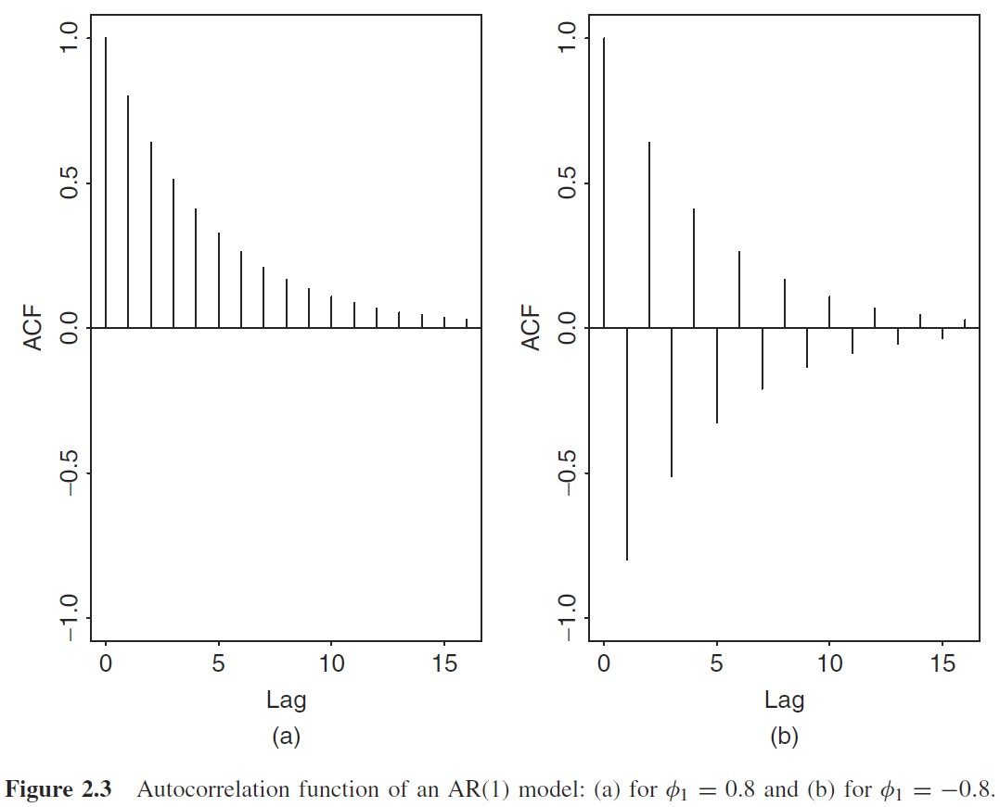

# 时间序列基本内容

## 2.1 基本假定

设时间节点$t$，有观测值$\{r_1,...,r_{t-1}\}$，这个观测值的集合（已知信息集）记作$F_{t-1}$，因而当前时点$r_t$可以分为**可观测部分**和**不可观测部分**：

$$
r_{t} = \mu_t + a_t = E(r_t|F_{t-1}) + \sigma_t \epsilon_t
$$

可观测部分记作$\mu_t$，被定义为当前值$r_t$关于已知信息集的条件期望；不可观测部分定义为$a_t$，即扰动项，可被定义为两项的乘积：$\sigma_t$是条件标准差（扰动项），$\epsilon_t$则假定为独立同分布的随机变量，且服从标准正态分布。**时间序列模型将同时研究$\mu_t,\sigma_t$对$\{r_t\}$序列性质的影响，并进行预测。**

## 2.2 基本概念

通常，我们遇到的问题是这样的，给定随机对数收益率序列$\{r_t|t = 1,...,T\}$，而需要求知：（1）序列的矩信息；（2）序列矩信息是否与时间$t$相关。

那么，为了做这方面的工作，我们需要明确几个概念。

### 平稳性

较强的平稳性是严平稳，即分布不随时间变化而改变。

/// admonition | 定义2.1 - 严平稳
      type: info

对$\forall t$，且有任意正整数$k$个观测点$\{t_1,...,t_k\}$，若序列$\{t_1,...,t_k\}$的联合分布与序列$\{t_{1+t},...,t_{k+t}\}$的联合分布一致，则称序列为严平稳序列。
///

严平稳是很严格的条件，放松一定条件，只追求**弱平稳（宽平稳）**条件：前两阶矩信息（主要是均值、方差）与时间无关，也即**$r_t$的均值、$r_t$与$r_{t-l}$的协方差，不随时间的变化而改变**。从而有以下几条：

- $E(r_t) = \mu$，序列平均值为常数；
- $Cov(r_t, r_{t-l}) = \gamma_l$，序列任意两期间的协方差只与相隔期数相关。

弱平稳意味着，$T$个值在一个常数间隔水平中相同幅度波动。

/// admonition | 严平稳不是宽平稳的充分条件
      type: warning

严平稳并不能推出宽平稳，因为宽平稳只追求前二阶矩的信息与时间无关，而对高阶矩信息没有要求，而严平稳严格限制了各阶矩信息。
///

### 自协方差

“我和过去的自己。”

定义$\gamma_l = Cov(r_t, r_{t-l})$为间隔为$l$的自协方差。由协方差的定义：

$$
\gamma_l = E[(r_t - \mu)(r_{t-l} - \mu)]
$$

在宽平稳条件下，自协方差有如下性质：

- $\gamma_0 = Var(r_t)$；
- $\gamma_{-l} = \gamma_l$，即自反性；

### 遍历性

/// admonition | 定义2.2 - 遍历性
      type: info

如果一个平稳序列（或者有一个协方差平稳过程）$\{r_t\}$满足$\sum_{j=0}^{\infty}|\gamma_{j}| <\infty$，则称序列$r_t$是关于均值遍历的。
///

遍历性的用处在于，给定样本$\{r_t\}$，则应有：

1. 当样本大小$T \to \infty$时，样本均值$\bar r = \frac{1}{T} \sum_{t=1}^T r_t$**依概率收敛**于$E(r_t)$，则该序列是关于均值遍历的。
2. 类似的，如果:

$$
\frac{1}{T-j} \sum_{t=j+1}^T [(r_t - \mu)(r_{t-j} - \mu)] \mathop{\to}^P r_j
$$

   对所有的$j$都成立，则称该序列关于二阶矩遍历。
3. 若一个平稳序列的自协方差$\sum_{j=0}^\infty |\gamma_j| < \infty$，则称该序列是关于均值遍历的。

这一条意味着当间隔逐渐拉长后，自协方差迅速趋近于0，即序列在长期上均值回归。

现实工作中，常常要求所用时间序列具有弱平稳性和遍历性。

### 自相关系数（ACF）

/// admonition | 定义2.3 - 自相关系数
      type: info

$r_t$ 与$r_{t-l}$的相关系数称作$r_t$的，间隔为$l$的自相关系数：

$$
\rho_l = \frac{Cov(r_t, r_{t-l})}{\sqrt{Var(r_t) Var(r_{t-l})}} = \frac{Cov(r_t, r_{t-l})}{Var(r_t)} =  \frac{\gamma_l}{\gamma_0}
$$

///

显然，$\rho_0 = 1$，且$\rho_l = \rho_{-l}$，此外，与其他的Pearson相关系数一样，$-1 \leq \rho_l \leq 1$。另外，若对于任意的$l 0$，都有$\rho_l = 0$，则称该弱平稳序列为不相关序列。

### 样本自相关系数

对应上面的内容，样本的自相关系数可以表示为：

$$
\hat \rho_l = \frac{\sum_{t=l+1}^T (r_t - \bar r)(r_{t-l}-\bar r)}{\sum_{t=1}^T (r_t - \bar r)^2} ,\quad 0 \leq l \leq T-1
$$

若序列$\{r_t\}$是独立同分布序列，且$E(r_t^2) < \infty$，对于任意正整数$l$，则$\hat \rho_l$渐近服从于均值为0，方差为$1/T$的正态分布。这个定义可以用于检验市场是否有效。如果市场收益率序列是不相关的序列，那么序列就和时间毫无关系，从而无法预测，这代表着市场实现了强有效（与过去信息毫无关联）。这个可以通过检验单个（或若干个）ACF值是否为0来实现：

(1) **单个ACF的一期检验**：对间隔为1的样本，可设立原假设$H0: \rho_1 = 0$，备择假设为$H1: \rho_1 \not = 0$。并进而构造t统计量：$t = \hat \rho_1 / \sqrt{1/T} = \sqrt{T} \hat \rho_1 \sim N(0,1)$。如果t统计量超过了置信分位点，则拒绝原假设，从而认为市场并不完全有效。

(2) **单个ACF的多期检验**：对给定正整数$l$（间隔为$l$的样本），和原假设、备择假设$H0: \rho_1 = 0$,$H1: \rho_1 \not = 0$，有t统计量。

$$
t = \frac{\hat \rho_l}{\sqrt{(1+2\sum_{i=1}^{l-1} \hat \rho_i^2)T}}
$$

   若$\{r_t\}$为平稳高斯序列且满足$j l$时有$\rho_j = 0$，则这个$t$统计量渐近服从标准正态分布。

(3) **多个ACF的检验（Ljung-Box检验）**。对于原假设$H0: \rho_1 = \rho_2 = ... = \rho_m = 0$和备择假设$H1: \rho_i \not = 0$，则有基于卡方分布的Ljung-Box检验量：

$$
Q(m) = T(T+2) \sum_{l=1}^m \frac{\hat \rho_l^2}{T-l}
$$

   该分布渐近服从自由度为$m$的卡方分布，卡方分布是单边检验，若$Q(m) \chi_i^2 (m)$，则拒绝原假设，证明序列并非不相关的。在实务中，通常将$m$设定为$\ln(T)$。

总体来讲，样本的自相关函数（ACF）在线性时序模型中起着重要的作用：一个线性时序模型完全可由ACF来决定。例如CAPM中，通常认为资本收益率不可预测且无相关性，那么检验样本的$\rho_l$是否为0，即可判定是否满足这一假定。

### 白噪声

/// admonition | 定义 2.4 - 白噪声
      type: info

如果$\{r_t\}$是一个具有有限均值和有限方差的序列独立同分布随机变量序列，则称$\{r_t\}$为一个白噪声序列。特别的，如果$r_t \sim N(0,\sigma^2)$，则称该序列为高斯白噪声序列。

(有限均值和有限方差可以确认这个序列弱平稳且遍历。)
///

白噪声性质与$ACF = 0$等价。白噪声并不一定是高斯白噪声（不一定服从正态分布），其核心要素在于有限均值方差，且独立同分布。

### 线性时间序列

/// admonition | 定义 2.5 - 线性时间序列
      type: info

时间序列$\{r_t\}$称为线性时间序列，如果可以写作以下形式：

$$
r_t = \mu + \sum_{i=0}^\infty \phi_i a_{t-i}
$$

即$r_t$可以表示为其均值和之前若干期扰动项的加权平均。

其中$E(r_t) = \mu$,权重序列$\phi_0 = 1$,$\{\alpha_t\}$是零均值的i.i.d序列。
///

那么有：

1. $Var(r_t) = \sigma_a \sum_{i=0}^{\infty} \phi_i^2$，其中$\{\phi_i^2\}$应当收敛，从而使方差有限。
2. 自协方差如下：

$$
\begin{aligned}
Cov(r_t,r_{t-l}) &= Cov(\mu+\sum_{t = 0}^\infty \phi_i a_{t-i}, \mu +\sum_{j=0}^\infty \phi_{j-l} a_{t-(j+l)})\\
         \text{（如果$\mu = 0$）}\quad  &= Cov(\sum_{t = 0}^\infty \phi_i a_{t-i}, \sum_{j=0}^\infty \phi_{j-l} a_{t-(j+l)})\\
         &= E(\sum_{i,j = 0}^{\infty} \phi_i \phi_j a_{t-i} a_{t-j-l})\\
         &= \sum_{j=0}^\infty \phi_{j+l} \phi_j E(a_{t-j-l}^2) = \sigma_a^2 \sum_{j=0}^\infty \phi_j \phi_{j+l}
\end{aligned}
$$

3. 自相关系数如下：

$$
\rho_l = \frac{\gamma_i}{\gamma_0} = \frac{\sigma_a^2 \sum_{j=0}^\infty \phi_j \phi_{j+l}}{\sigma_a^2(1+\sum_{j=1}^\infty \phi_j^2)
         } = \frac{\sum_{j=0}^\infty \phi_j \phi_{j+l}}{1+\sum_{j=1}^\infty \phi_j^2}  \quad (l 0)
$$

   对于弱平稳序列，对于$j \to \infty$，有$\phi_j \to 0$，从而随着间隔$l$的增大，$\rho_l \to 0$。那么，遥远过去的信息对当前收益率的影响逐渐趋向于0（当前信息对过去信息的线性依赖逐渐消失），从而出现自相关的截尾性。

## 2.3 基本模型1：自回归模型（AR）

即**A**uto**R**egressive model。最简单的自相关模型是AR(1)，即对$r_t$和$r_{t-1}$建立模型。

$$
r_t = \phi_0 + \phi_1 r_{t-1} + a_t, \quad a_t \sim N(0,\sigma_a^2)
$$

其中$a_t$为高斯白噪声序列。那么：

- 在已知$r_{t-1}$的条件下:

$$
E(r_t|r_{t-1}) = \phi_0 + \phi_1 r_{t-1},\quad  Var(r_t |r_{t-1}) = Var(a_t) = \sigma_a^2
$$

- 在给定$r_{t-1}$的条件下，$r_t$与$r_{t-i}(i 1)$无关。即AR(1)对于远期信息，存在Markov性；或者说对于AR($p$)模型对于超过$p$期的信息存在Markov性。

也就是说，AR(p)模型中，$r_t$只与最近$p$个观测值相关。

### AR(1)的性质

假定序列$\{r_t\}$弱平稳。并设$E(r_t) = \mu, Var(r_t) = \gamma_0, Cov(r_t, r_{t-j}) = \gamma_j\quad \forall j$，其中$\mu,\gamma_0$为常数，而$\gamma_j$与$j$相关。下面推导$\mu, \gamma_0$的具体形式：

/// details | AR(1)的期望性质
      type: note

$$
\mu = E(r_t) = \phi_1 E(r_{t-1}) + \phi_0 \Rightarrow \mu = \frac{\phi_0}{1-\phi_1} \quad (\phi_1 \not = 1)
$$

///

/// details | AR(1)的方差性质
      type: note

而对于$\gamma_0$，则不能直接两边取方差，而要剔除其交叉项。利用前面的$\phi_0 = (1-\phi_1)\mu$，将$AR(1)$改写为：

$$
r_t - \mu = \phi_1(r_{t-1} - \mu) + a_t 
$$

令$X_t = r_t - \mu$，从而有：

$$
\begin{aligned}
      X_t &= \phi_1 X_{t-1} + a_t = \phi_1(\phi_1 X_{t-2} + a_{t-1}) + a_t \\
      &= \phi_1^2 X_{t-2} + \phi_1 a_{t-1} + a_t\\
      &= \ldots\\
      &= a_t + \phi_1 a_{t-1} + \phi_1^2 a_{t-2} + ... = \sum_{i=0}^{\infty} \phi_1^i a_{t-i}
\end{aligned}
$$

从而说$r_t - \mu$为$a_{t-i}, i \geq 0$的线性加权，又因为$\{a_t\}$独立同分布，从而有：

$$
E[(r_t-\mu)a_{t+1}] = 0
$$

将上式带回$r_t - \mu = \phi_1(r_{t-1} - \mu) + a_t$，并取期望：

$$
\begin{aligned}
      E[(r_t - \mu)^2] &= E[(a_t + \phi_1(r_{t-1} - \mu))^2]\\
      \operatorname{Var}(r_t) &= E[a_t^2 + 2\phi_1 a_t(r_{t-1} - \mu) \phi_1^2 (r_{t-1} - \mu)^2]\\
      &= E[a_t^2] + 2\phi_1 E[a_t(r_{t-1} - \mu)] + \phi_1^2 E[(r_{t-1} - \mu)^2] \quad \text{(第二项由上面的式子可知为0)}\\
      &= \sigma_a^2 + \phi_1^2 \operatorname{Var}(r_t)
\end{aligned}
$$

从而有：

$$
\gamma_0 = \operatorname{Var}(r_t) = \frac{\sigma_a^2}{1-\phi_1^2}, \quad \phi_1^2 < 1 \Rightarrow |\phi_1| < 1 \tag{AR1.Gamma}
$$

由以上内容，我们可以得到AR(1)模型弱平稳的一个充要条件：$|\phi_1| < 1$。将$\phi_0 = (1-\phi_1)\mu$带入AR(1)模型，则AR(1)可以表示为：

$$
r_t = (1-\phi_1) \mu + \phi_1 r_{t-1} + a_t
$$

即AR(1)可以表示为均值（可能是市场均值）和上期值的加权平均，整得很像CAPM。
///

/// details | AR(1)的自相关系数（ACF）性质
      type: note

从式$r_t - \mu = \phi_1(r_{t-1} - \mu) + a_t$开始，两端乘以$a_t$，取期望：

$$
E[a_t(r_t - \mu)] = \phi_1 E[a_t (r_{t-1} - \mu)] + E[a_t^2]= \sigma_a^2
$$

而对式$r_t - \mu = \phi_1(r_{t-1} - \mu) + a_t$两端同乘$r_{t-l} - \mu$，取期望：

$$
\begin{aligned}
      E[(r_t - \mu) (r_{t-l} - \mu)] &= E[(\phi_1(r_{t-1} - \mu) + a_t)(r_{t-l} - \mu)]\\
      &= \phi_1 E[(r_{t-1} - \mu)(r_{t-l} - \mu)]
\end{aligned}
$$

如果$l = 0$，则$\gamma_l = \phi_1 \gamma_1 + \sigma_a^2$，否则$\gamma_l = \phi_1 \gamma_{l-1}$。由以上内容和式(AR1.Gamma)可导出AR(1)的ACF满足：

$$
ACF = \frac{\gamma_l}{\gamma_0} = \frac{\phi_1^l \gamma_0}{\gamma_0} = \phi_1^l
$$

由于$\phi_1 \in (-1,1)$，所以ACF会呈现两种典型性的指数级衰减，如Tsay书Figure 2.3。

///

### AR(2)的性质

将自回归模型扩张到2期：

$$
r_t = \phi_0 + \phi_1 r_{t-1} + \phi_2 r_{t-2} + a_t, a_t \sim N(0,\sigma_a^2)
$$

仍然从期望、方差、ADF上讨论其性质：

/// details | AR(2)的期望和方差
      type: note

类似于前面AR(1)，其矩信息应当有如下性质：

$$
E(r_t) = \mu = \frac{\phi_0}{1-\phi_1 - \phi_2}, \quad \phi_1 + \phi_2 \not = 0
$$

而利用$\phi_0 = (1-\phi_1 - \phi_2)\mu$，从而有：

$$
\begin{align}
      r_t - \mu &= \phi_1(r_{t-1} - \mu) + \phi_2(r_{t-2} - \mu) + a_t \tag{0}\\
      E[(r_t - \mu)^2] &= \phi_1 E[(r_{t-1} - \mu)(r_{t-2} - \mu)] + \phi_2 E[(r_{t-2} - \mu)(r_t - \mu)]+ E[a_t(r_t - \mu)]\\
      \text{即有} \quad \gamma_0 &= \phi_1 \gamma_1 + \phi_2 \gamma_2 + \sigma_a^2\tag{1}
\end{align}
$$

类似的，对式(0)左右同乘$(r_{t-1} - \mu)$或$(r_{t-2} - \mu)$，并左右同取期望，则可以获得$\gamma_1, \gamma_2$的表达式：

$$
\begin{align}
      \gamma_1 &= \phi_1 \gamma_0 + \phi_2 \gamma_1\tag{2}\\
      \gamma_2 &= \phi_1 \gamma_1 + \phi_2 \gamma_0\tag{3}
\end{align}
$$

联立式(1-3)，利用矩阵方程求解（利用Cramer法则）
///

/// details | AR(2)的ADF性质
      type: note

对式$(0)$同乘$(r_{t-l} - \mu)$并取期望:

$$
E[(r_{t-l} - \mu)(r_t - \mu)] = \phi_1 E[(r_{t-l} - \mu)(r_{t-1} -\mu)] + \phi_2 E[(r_{t-2} - \mu) (r_{t-l} - \mu)] + E[(r_{t-l}-\mu) a_t]
$$

当$l 0$时，$E[(r_{t-l} - \mu) a_t] 0$，从而有：

$$
\gamma_l = \phi_1 \gamma_{l-1} + \phi_2 \gamma_{l-2}
$$

该方程称作AR(2)的矩方程。对于$l=0$，有$\rho_0 = 1$，而$\rho_1 = \phi_1 / (1-\phi_2)$。对于更大阶的情况，两边同除以$\gamma_0$，有：

$$
\rho_l = \phi_1 \rho_{l-1} + \phi_2 \rho_{l-2} (l 0)
$$

平稳AR(2)序列的ACF满足二阶差分方程：

$$
(1-\phi_1 B - \phi_2 B^2)\rho_l = 0 \tag{4}
$$

其中$B$称作“向后推移算子”，其定义为$B \rho_l = \rho_{l-1}$，即ACF的向后推移。

（注：有的论著中采用向后推移算子$L$，且有$L\gamma_l = \gamma_{l-1}$。）
///

### AR(2)的差分

已知时间序列$\{r_t\}$在$t$时刻的值$r_t$和$t-1$时刻的值$r_{t-1}$，二者相减之差$dt = r_t - r_{t-1}$，得到的新序列$\{dt\}$称作$\{r_t\}$的一阶差分，如果再对$\{dt\}$序列再做一次差分，则新序列是$\{r_t\}$的二阶差分。差分操作可以将非平稳的序列近似转换为弱平稳序列。回到上面的AR(2)方程中，式(4)决定了平稳AR(2)模型的性质，而与这个差分方程对应的是AR(2)的特征方程：

$$
1-\phi_1 X - \phi_2 X^2 = 0 \tag{5}
$$

/// details | 对AR(2)特征方程的推导
      type: success

该部分的证明并未被Tsey给出。

对于$p$阶差分方程:

$$
r_t = \phi_1 r_{t-1} + \phi_2 r_{t-2} + ... + \phi_p r_{t-p} + a_t \tag{6}
$$

定义向量$\epsilon_t = [r_t, r_{t-1}, ..., r_{t-p+1}]^T$。另定义矩阵：

$$
F = \left[ \begin{array}{ccccc}
\phi_1 & \phi_2 & ... &\phi_{p-1} & \phi_p \\
1 & 0 & ... & 0 & 0\\
0 & 1 & ... & 0 & 0\\
... & ... & ... & ... & ...\\
0 & 0 & ... & 1 & 0
\end{array}\right], \quad V_t = \left[\begin{array}{c}
a_t \\
0\\
...\\
0
\end{array}\right]
$$

那么式(6)可以被表示为一个一阶的向量系统：

$$
\epsilon_t = F \epsilon_{t-1} + V_t \tag{7}
$$

进一步迭代式(7)，从一阶向量系统迭代$t$次，成为$t$阶向量系统：

$$
\begin{aligned}
\epsilon_t &= F \epsilon_{t-1} + V_t \\
&= F(F\epsilon_{t-2} + V_{t-1}) + V_t = ...\\
&= F^{t+1} \epsilon_{(-1)} + F^t V_0 + ... + FV_{t-1} + V_t
\end{aligned}
$$

把向量的具体形式带到向量系统中：

$$
\left[\begin{array}{c}
r_t  \\
r_{t-1}\\
...\\
r_{t-p+1}
\end{array}\right] = F^{t+1} \left[\begin{array}{c}
r_1\\
r_2\\
...\\
r_{p-1}
\end{array}\right] + F^t \left[\begin{array}{c}
a_0\\
0\\
...\\
0
\end{array}\right] + ... + F\left[\begin{array}{c}
  a_{t-1}  \\
  0\\
  ...\\
  0
\end{array}\right] + \left[\begin{array}{c}
  a_t  \\
  0\\
  ...\\
  0
\end{array}\right]
$$

这个大方程组有什么用呢？第一行（第一个方程）就刻画了$r_t$的结构。令$f_{(pq)}^{(t)}$表示$F^t$中的第$(p,q)$个元素，则有：

$$
r_t = f_{(11)}^{(t+1)} + f_{(12)}^{(t+1)} r_2 + ... + f_{(1p)}^{(t+1)} r_p + f_{(11)}^t a_0 + f_{(11)}^{(t-1)} a_1 + ... + a_t
$$

对这个向量系统进行推广，做一个$j$期的迭代：

$$
\begin{align}
\epsilon_{t+j} &= F^{j+1} \epsilon_{t-1} + F^j V_t + ... + FV_{t+j-1} V_{t+j}\\
r_{t+j} &= f_{(11)}^{(j+1)} r_{t-1} + ... + f_{(1p)}^{(j+1)} r_{t-p} + f_{(11)}^j a_t + ... + f_{(11)}^1 a_{t+j-1} + a_{t+j}
\end{align}
$$

从上式可知$f_{(11)}^j = \partial r_{t+j} / \partial a_t$，该量被称作“动态乘子”，表示一单位$a_t$的变化（扰动）对$r_{t+j}$的影响。由于该量是$F$的最左上角元素，因此只需寻找$F$矩阵的特征值，即可同等刻画这一个扰动影响。即解方程：$|F - \lambda I_p| = 0$，其中$\lambda$为特征值。对于AR(2)模型，有：

$$
\begin{aligned}
 &\left|\left[\begin{array}{cc}
     \phi_1 & \phi_2 \\
     1 & 0 
 \end{array}\right] - \left[\begin{array}{cc}
     \lambda & 0 \\
     0 & \lambda
 \end{array}\right] \right| = 0\\
 \textbf{从而有}\quad &\lambda^2 - \phi_1 \lambda - \phi_2 = 0 \Rightarrow 1-\phi_1 x - \phi_2 x^2 = 0
\end{aligned}
$$

///
其中$x = 1/\lambda$，即$F$特征值的倒数，用二次方程求根公式：

$$
x = \frac{\phi_1 \pm \sqrt{\phi_1^2 + 4\phi_2}}{-2\phi_2} \label{eq: ar2_checkpoint}
$$

得到的特征根为双根$(\omega_1,\omega_2)$，要讨论实根和虚根问题。

- 如果两根均为**实根**，则方程分解为：$(1-\omega_1 B)(1-\omega_2 B)$的形式，此时AR(2)可以表示为两个AR(1)的叠加。AR(1)的ACF曲线取决于$\phi_1$的取值，那么这种AR(2)的ACF曲线就是两个AR(1)叠加起来，即两个指数函数的复合，其图形取决于两个$\phi$的取值。
- 如果两根均为**虚根**，那么$\omega_1,\omega_2$为复数共轭对，而复数共轭对可以表示为极坐标中的正弦/余弦曲线，这种情况下的ACF表示为减幅的正弦、余弦波。该种情况在商业和经济应用上比较重要，正弦波形式的ACF可以导致商业环/商业周期的出现。带一对复共轭特征根的AR(2)模型的随机环的平均长度（减幅正弦函数的平均周期）可以由以下式子给出：

$$
k = \frac{2\pi}{\cos^{-1}[\phi_1/(2\sqrt{-\phi_2})]} = \frac{2\pi}{\operatorname{arccos}[\phi_1/(2\sqrt{-\phi_2})]}
$$

如果将复数解记为$a \pm b_i$的形式，则$\phi_1 = 2a, \phi_2 = -(a^2+b^2)$，则上式可写为：

$$
k = \frac{2\pi}{\cos^{-1} (a / \sqrt{a^2+b^2})}
$$

进而引出AR(2)模型平稳的必要条件：**AR(2)模型两个特征根($\omega$)的模都要小于1**。对应特征方程（式5）的两个解($x$)的模都要大于1。该条件同样适用于AR(1)模型。其对应特征方程$1-\phi_1 x = 0$，对应特征根解为$\omega = 1/x = \phi_1$，则该必要条件要求$|\phi_1| < 1$。而对于AR(p)模型呢？对于AR(p)模型，其对应的多项式方程为：

$$
1-\phi_1 x - \phi_2 x^2 - ... - \phi_p x^p = 0
$$

那么序列$\{r_t\}$平稳的条件就是所有解的模都要大于1，即所有特征根的模都小于1，而这个条件通常难以保证，因此尽量要采用低阶AR模型，因而牵扯到重要的问题：定阶。

### AR模型的定阶

定阶，即确定AR(p)中的唯一参数：$p$。有几种主要的方法，如偏自相关函数（PACF）、信息准则法。

第一种， **偏自相关函数法**。考虑一连串的AR模型：

$$
\begin{align}
      r_t &= \phi_{01} + \phi_{11} r_{t-1} + e_{1t}\\
      r_t &= \phi_{02} + \phi_{12} r_{t-1} + \phi_{22} r_{t-2} + e_{2t}
\end{align}
$$

对这两个模型做估计，那么$\hat \phi_{22}$表示在AR(1)模型基础上，添加$r_{t-2}$对$r_t$拟合的贡献。以此类推，不断尝试和验证，我们称$\hat \phi_{ll}$为$r_t$的间隔为$l$的偏自相关函数(PACF)，这个过程中每一个$\hat \phi_{ll}$就可以形成一个估计值的向量。由于AR模型的PACF具有截尾性质，因而适合用于定阶。计算PACF主要依赖于Yule-Walker方程。

在讲Yule-Walker之前，显然有$AR(1)$的PACF和ACF相等，别问我为什么，问就是定义所得。

/// details | Yule-Walker方程组
      type: note
**Yule-Walker方程组**：对于AR(p)模型，两边同时乘以$r_{t-k} (k \geq 1)$后取期望。要注意的是，以下所指$\phi_k$，均为AR(p)中的第$k$的$\phi$参数，放在上面两式的语境中，应当称作$\phi_{pk}$，而只有$\phi_{pp}$（也就是下面Yule-Walker方程中的$\phi_p$）才是AR(p)模型在$p$阶处的PACF。

$$
E(r_t r_{t-k}) = \phi_1 E(r_{t-1} r_{t-k}) + ... + \phi_p E(r_{t-p} r_{t-k}) + E(a_t r_{t-k}) \Rightarrow \gamma_k = \phi_1 \gamma_{k-1} + ... + \phi_p \gamma_{k-p}
$$

当然，两边同除$\gamma_0$，有：

$$
\rho_k = \phi_1 \rho_{k-1} + ... + \phi_p \gamma_{k-p}
$$

以$\gamma_k$表达式，将$k = 1,...,p$分别写出来，形成下面的矩阵方程。

$$
\left(\begin{array}{c}
   \gamma_1\\
   \gamma_2\\
   \vdots\\
   \gamma_p
\end{array}\right)  = \left(\begin{array}{cccc}
   \gamma_0 & \gamma_1 & \ldots &\gamma_{p-1} \\
   \gamma_1 & \gamma_0 &\ldots & \gamma_{p-2}\\
   \vdots & \vdots & \ddots & \vdots\\
   \gamma_{p-1} & \gamma_{p-2} & \ldots & \gamma_{0}
\end{array}\right) \left(\begin{array}{c}
   \phi_1\\
   \phi_2\\
   \vdots\\
   \phi_p
\end{array}\right) :\Rightarrow \quad \mathbf{\gamma}_p   = \mathbf{\Gamma}_p \mathbf{\phi}_p \label{eq: Yule-Walker eqs}
$$

该方程组即为Yule-Walker方程组。
///

为了求解PACF，我们需要让$\phi_p$暴露出来，从式$\eqref{eq: Yule-Walker eqs}$左右同除以$\gamma_0$，有：

$$
\left(\begin{array}{cccc}
         1 & \rho_1 & \ldots & \rho_{k-1} \\
         \rho_1 & 1 & \ldots & \rho_{k-2}\\
         \vdots & \vdots & \ddots & \vdots \\
         \rho_{k-1} & \rho_{k-2} & \ldots & 1
      \end{array}\right) \left(\begin{array}{c}
         \phi_1\\
         \phi_2\\
         \vdots\\
         \phi_p
      \end{array}\right) = \left(\begin{array}{c}
         \rho_1\\
         \rho_2\\
         \vdots\\
         \rho_k
      \end{array}\right)
$$

解这个方程组的好办法是Cramer法则。将上式左侧系数阵的第$p$列（即最后一列）替换为等号右边的向量，分子即为这个新矩阵的行列式，而分母是原系数矩阵的行列式，所求得的商即为$\phi_{p}$的解，即AR模型系数所谓的Yule-Walker估计量。如果$\{r_t\}$是AR(p)过程，且$\{a_t\} \sim N(0,\sigma_a^2) i.i.d.$，则Yule-Walker估计量$\hat \phi_p$服从分布：

$$
(\hat \phi_p - \phi) \sim N(\mathbf{0}, n^{-1} \sigma_a^2 \mathbf{\Gamma}_k^{-1})
$$

其中$n$为样本容量。基于此可以求得Yule-Walker估计量的置信区间。

第二种，**信息准则法**。信息准则（Information Criteria，IC）本质上是对残差的调整，常用的信息准则包括Akaike IC(AIC，赤池信息准则)和Bayesian IC(BIC，贝叶斯信息准则)。

   - 赤池信息准则。AIC的形式为：

$$
AIC = \frac{-2}{T} \ln (\text{似然函数最大值}) + \frac{2}{T} (\text{参数个数})
$$

   特别的是，对于高斯AR(l)模型，AIC的形式为：

$$
AIC(l) = \ln(\tilde \sigma_l^2) + \frac{2l}{T}
$$

   - ==贝叶斯信息准则==。BIC基于AIC进行调整，对于高斯AR(l)模型，其形式为：

$$
BIC(l) = \ln (\tilde \sigma_l^2) + \frac{l \ln(T)}{T}
$$

BIC的改进位于第二项，将分子上的$2$改为$\ln(l)$。对于样本容量较大的情形，基于BIC的定阶方法倾向于*选择更小阶*的AR模型。

争议处理：PACF，AIC，BIC结果存在偏差时，可以优先按照BIC意见定阶，也可以选择三选二的方式，投票得出定阶方案。

### AR模型的参数估计

AR模型的估计采用条件最小二乘估计（CLS）。在给定前$p$个观测值的条件下，进行多元线性回归。在前$p$个观测值的条件下，利用其他观测值回归下列模型：

$$
\tilde r_t = \phi_0 + \phi_1 r_{t-1} + ... + \phi_p r_{t-p}
$$

对应的残差为$\tilde a_t = r_t - \tilde r_t$，称$\{\tilde a_t\}$为残差序列，而该残差序列的残差平方和（样本外残差平方和）为：

$$
\tilde \sigma_a^2 = \frac{\sum_{t = p+1}^{T} \hat a_t^2}{T-2p-1}
$$

而条件最小二乘的任务是最小化样本外残差平方和：

$$
\hat \phi = \mathop{\operatorname{argmin}}_\phi \hat \sigma_a^2 = \mathop{\operatorname{argmin}}_\phi ||y-X\beta||^2
$$

其中，$y = [\hat r_{p+1}, \hat r_{p+2}, ..., \hat r_T]^T$, $\beta = [\hat \phi_0,...,\hat \phi_p]^T$，$X$是对$y$向量进行拟合的式子中所有变量的集合。且$X\in \mathcal{R}^{(T-p)\times (p+1)}, \beta \in \mathcal{R}^{(R+1) \times 1}, y \in \mathcal{R}^{(T-p) \times 1}$。对$\hat \sigma_a^2$做微分求最值，解得经典老式子：

$$
\hat \beta = (X^TX)^{-1}X^Ty
$$

备注两则：

- 如果上面的$\{y_t\}$的分布未知，CLS估计所得的参数仍然是合理的。
- 如果$\{y_t\}$样本的联合密度$P(y_1,...,y_T)$已知，则除了CLS，也可使用MLE来估计，CLS和MLE对参数的估计值是一致的，但MLE对方差的估计有区别：

$$
\tilde \sigma_a^2 \textbf{(MLE)} = \frac{T-2p-1}{T-p}  \hat \sigma_a^2 \textbf{(CLS)}
$$

### 模型检验

该工作用于验证模型是否充分，或者参数是否冗余。AR模型的检验工作采用Ljung-Box检验。其思想为，如果模型充分，则残差序列$\{\hat a_t\}$应当为白噪声，而检验序列是否为白噪声的工作可以用Ljung-Box检验进行，它将检验序列与一般白噪声的接近程度：

$$
Q(m) = T(T+2) \sum_{l=1}^m \frac{\hat \rho_l^2}{T-l} \sim \chi_\alpha^2 (m-g)
$$

其中$g$为AR模型中的参数个数。

### 模型的拟合优度

拟合优度，就是$R^2$：

$$
R^2 = 1-\frac{\text{Square Sum of Residual}}{\text{Square Sum Totally}} = 1-\frac{\sum_{t=p+1}^T \hat a_t^2}{\sum_{t=p+1}^T (r_t - \bar r)^2}
$$

其中$\bar r = \frac{1}{T-p} \sum_{t = p+1}^T r_t$。如果序列平稳，则$R^2$越大，模型拟合情况越好。但对于时间序列来说，变量个数对$R^2$会产生影响，为了剔除自变量个数对$R^2$的影响，时间序列中引入了Adjusted $R^2$，其形式为：

$$
\text{Adjusted } R^2 = 1- \frac{\hat \sigma_a^2}{\hat \sigma_r^2} = 1-\frac{\frac{1}{T-2p-1}\sum_{t=p+1}^T \hat a_t^2}{\frac{1}{T-p-1}\sum_{t=p+1}^T (r_t - \bar r)^2} = 1-\frac{T-p-1}{T-2p-1}(1-R^2)
$$

大多数情况下，Adjusted $R^2$仍在$(0,1)$之间，但是可能会出现超出该范围的情况，通常需要分析该现象出现的原因。Adjusted $R^2$有一个好，如果新加入的变量$(X)$对回归的贡献较少，则Adjusted $R^2$反而可能降低，这就体现了Adjusted $R^2$对模型自变量数量的限制作用。

### AR模型的预测

设时间指标$h$为预测原点，$l$为预测步长，想预测$r_{h+l}$。定义$\hat r_h(l)$为最小均方误差下的预测，则$\hat r_h(l)$应当满足：

$$
E\{[r_{h+l} - \hat r_h(l)]^2|F_h\} \leq \min_g E[(r_{h+l} - g)^2|F_h]
$$

其中$g$为时点$h$下所得的信息函数，即时点$h$下所能得到的所有信息$F_h$的函数。

**(1) 向前一步预测**。让我们想想AR(p)中$r_{h+1}$的结构是：

$$
r_{h+1} = \phi_0 + \phi_1 r_h + ... + \phi_p r_{h+1-p} + a_{h+1}
$$

   而$h$时刻下拥有的信息集是什么？$F_h = \{r_h,r_{h-1},...\}$，那么就可以得到$r_{h+1}$点预测的条件期望。从而有：

$$
\hat r_h(1) = E(r_{h+1}|F_h) =  \phi_0 + \phi_1 r_h + ... + \phi_p r_{h+1-p} = \phi_0 + \sum_{i=1}^p \phi_i r_{h+1-i}
$$

   那么，这个条件期望和原本的$r_{h+1}$之间的区别就在于最后的扰动项$a_{h+1}$，也就是预测的误差：

$$
e_h(1) = r_{h+1} - \hat r_h(1) = a_{h+1}
$$

   而误差的方差是：

$$
Var[e_h(1)] = Var(a_{h+1}) = \sigma_a^2
$$

   如果$\{a_t\}$是服从正态分布的，那么$\{r_t\}$序列向前一步预测（即$r_{h+1}$）的点预测具有的预测区间即为$[\hat r_h(1) - \eta_\alpha \sigma_a, \hat r_h(1) + \eta_\alpha \sigma_a]$，其中$\eta_\alpha$是对应置信度$\alpha$的置信区间上下界。

**(2)** **向前两步预测**

对第二步的预测，其作为条件的信息集仍然为$F_h$。原始的$r_{h+2}$结构为：

$$
r_{h+2} = \phi_0 + \phi_1 r_{h+1} + ... + \phi_p r_{h+2-p} + a_{h+2}
$$

而预测值的结构如下，注意的是，对于第二步预测，$r_{h+1}$仍然是未知的（你仍然站在时点$h$往后看）：

$$
\hat r_h(2) = E[r_{h+2}|F_t] = \phi_0 + \phi_1 \hat \phi_h(1) + \phi_2 r_h +...+\phi_p r_{h+2-p}
$$

那么预测误差为：

$$
e_h(2) = \phi_1[r_{h+1} - \hat r_h(1)] + a_{h+2} = \phi_1 a_{h+1} + a_{h+2}
$$

其方差为：

$$
Var[e_h(2)] = [1+\phi_1^2] \sigma_a^2 \geq Var[e_h(1)]
$$

显然，随着预测步长的增加，进一步预测结果的不确定性会逐渐增加。

**(3) 向前$l$步预测**。

向前$l$步预测的点值为：

$$
r_{h+l} = \phi_0 + \phi_1 r_{h+l-1} + ... + \phi_p r_{h+l-p} + a_{h+l}
$$

对应的预测值为：

$$
\hat r_h(l) = \phi_0 + \sum_{i=1}^p \phi_i \hat r_h(l-i)
$$

如果$l - i \leq 0$，那么那部分就是包含在$F_h$中的，即已知精确值的部分。其预测误差的结构为：

(本来是有式子的，不想推了)

/// details | 均值回转(mean reversion)现象
      type: info

对于一个平稳的AR(p)模型，当$l \to \infty$时，$\hat r_h(l)$收敛于$E(r_t)$，即预测的有条件均值逐渐逼近到无条件均值（你已知的信息已经不足以预测很靠后的值了，你的预测几乎起不到任何作用）。而均值回转现象存在“半衰期”，对于$AR(1)$模型，其均值回转的半衰期为$k = \ln (0.5/|\phi_1|)$。
///
## 2.4 基本模型2：滑动平均（MA）

对于无穷阶的AR模型，应有：

$$
r_t = \phi_0 + \phi_1 r_{t-1} + ... + a_t
$$

当$i \geq 1$时，设$\phi_i = -\theta_1^i$，则较遥远的过往信息对当下值的影响就变得微不足道了，上式变为：

$$
r_t = \phi_0 - \theta_1 r_{t-1} - \theta_1^2 r_{t-2} -... + a_t
$$

为了使模型平稳，$\theta_1$的绝对值应当小于1。对上面做移项：

$$
r_t + \theta_1 r_{t-1}+\theta_1^2 r_{t-2} + ... = \phi_0 + a_t
$$

同理，我们还能得到：

$$
r_{t-1} + \theta_1 r_{t-2} + \theta_1^2 r_{t-3} + ... = \phi_0 + a_{t-1}
$$

两式相减，能够得到：

$$
r_t = (1-\theta_1)\phi_0 + a_t - \theta_1 a_{t-1} = C_0 + a_t - \theta_1 a_{t-1} = C_0 + (1-\theta_1 B)a_t
$$

其中$C_0$为常数，$a_t \sim N(0,\sigma_a^2)$这样，$r_t$的无穷阶AR模型就变成了当期扰动项和往期扰动项的线性加权。该改进后的模型被称作一阶滑动平均模型，即MA(1)模型。显然，MA(1)仍然是平稳的。类似的，MA(q)模型的形式为：

$$
r_t = C_0 + a_t - \theta_1 a_{t-1} -... - \theta_q a_{t-q} = C_0 + (1-\theta_1 B - ... - \theta_q B^q) a_t
$$

### MA模型的基本性质

/// details | MA模型的平稳性
      type: note
      open: True

MA(q)模型总是平稳的，因为：

- MA(q)是有限个($q$个)白噪声的线性加权;

- 其前两阶矩不随时间变化而变化（满足宽平稳条件）；

对于MA(1),有$r_t = C_0 + a_t - \theta_1 a_{t-1}$，对应均值方差为：

$$
E(r_t) = C_0; \quad Var(r_t) = (1+\theta_1^2)\sigma_a^2
$$

对于MA(q)模型，其均值方差为:

$$
E(r_t) = C_0; \quad Var(r_t) = (1+\theta_1^2 + ... + \theta_q^2) \sigma_a^2
$$

- 自协方差只与$l$有关。以MA(1)为例，若$C_0 =0$，则有：

$$
\gamma_l = E[(r_t - \mu) (r_{t-l} - \mu)] = E[(r_{t-l}a_t)] - \theta_1 E(r_{t-l}a_{t-1}) = -\theta_1 E(r_{t-l}a_{t-1})
$$

(第三个等号的原因在于，$r_{t-l}$是往期$a_t$的线性加权，而这些往期扰动与当期扰动之积的期望为0。)

a. 若$l=1$，则$\gamma_1 = -\theta_1 \sigma_a^2$;

b. 若$l>1$，则$\gamma_l = 0$。

总之，$\gamma_l$甚至与时间$l$无关，在任何情况下均为常数。

由以上三条可知，MA(q)模型必然是平稳的。
///

/// details | MA模型的ACF
      type: note
      open: True

MA(1)的ACF很漂亮，$\rho_0 = 1,\rho_1 = \gamma_1 / \gamma_0 = \frac{-\theta_1}{1+\theta_1^2}, \rho_l = 0 (l>1)$。即MA(1)的自相关系数只有在1阶处非零（间隔为1之后是截尾的），而该值的范围为$[-0.5,0.5]$，最小值取在$\theta_1 = 1$，最大值取在$\theta_1 = -1$。很明显，MA(1)模型的一个美德就是，ACF曲线会在滞后期内迅速衰减到0。

进一步，MA(2)模型：$r_t = a_t - \theta_1 a_{t-1} - \theta a_{t-2}$（方便起见，假定$C_0$为0）的ACF为：

$$
\rho_1 = \frac{-\theta_1 + \theta_1 \theta_2}{1+\theta_1^2 + \theta_2^2}; \quad \rho_2 = \frac{-\theta_2}{1+\theta_1^2 + \theta_2^2}; \quad \rho_l = 0, \forall l 2
$$

其中$\rho_1$的范围为$[-1/\sqrt{2},1/\sqrt{2}]$，$\rho_2$范围为$[-1/2,1/2]$。MA(2)在间隔为2之后截尾，从此归纳，MA(q)至于其前q个滞后项相关，这一点也称作**MA的有限记忆性**。
///

/// details | MA模型的可逆性
      type: note
      open: True

改写MA(1)模型，则有：$a_t = r_t + \theta_1 a_{t-1}$，重复迭代：

$$
a_t = r_t + \theta_1 r_{t-1} + \theta_1^2 r_{t-2} + ...
$$

   该方程称作AR($\infty$)过程，表示当期扰动项$a_t$为现在及过去所有期收益率的线性组合，且$|\theta_1| < 1$，这就是MA(1)的可逆性（MA由AR变化得来，也可以变化出AR）。对于MA(q)模型，有$r_t - C_0 = (1-\theta_1 B - \theta_2 B^2 - ...) a_t$，其特征方程为：

$$
1- \theta_1 X - \theta_2 X^2 -... - \theta_q X^q = 0
$$

该方程解落在单位圆之外，则MA(q)模型可以转化为AR($\infty$)过程，即MA(q)可逆。

>如果可解，则特征方程可以转化为$(1-\lambda_1 X)(1-\lambda_2X)...(1-\lambda_q X) = 0$，那么方程解均落在单位圆之外，等价于所有$|\theta_i| \leq 1$，即特征方程根的模均大于1。
///

### MA模型的估计

MA模型的定阶主要看**ACF的取值**。而估计主要采用两种方法：（1）条件似然法；（2）精确似然法。
>MA模型的PACF是拖尾的，而ACF是截尾的，因此需要用ACF来指导定阶。下面讲到ARMA模型时会对ACF和PACF指导定阶的准则做更细致的讲解。

/// details | 条件似然法
      type: note
      open: True

设初始扰动$a_0 = 0$，有$a_1 = r_1 - C_0$，$a_2 = r_2 - C_0 + \theta_1 a_1$，......。递归得到最优的扰动序列，再进行参数估计。

对于MA(1)模型，即$r_t = \mu + a_t + \theta_1 a_{t-1}, a_t \sim N(0,\sigma_a^2)$。我们令$\Theta = (\mu, \theta_1, \sigma_a^2)^T$。如果$a_{t-1}$已知，那么$r_t$的所有不确定性都存在于$a_t$上，那么有：

$$
r_t | a_{t-1} \sim N(\mu + \theta_1 a_{t-1}, \sigma_a^2)
$$

其边际密度函数为：

$$
f_{r_t|a_{t-1}}(r_t|a_{t-1}; \Theta) = \frac{1}{\sigma \sqrt{2\pi}} \mathop{exp} [\frac{-(r_t - \mu - \theta_1 a_{t-1})^2}{2\sigma^2}]\tag{8}
$$

从$a_0 = 0$开始，则$r_1 |a_0 = 0 \sim N(\mu,\sigma_n^2)$，给定观测值得$a_1 = r_1 - \mu$，带入到式(8)$中：

$$
f_{r_2|r_1,a_0}(r_2 |r_1, a_0 = 0;\Theta) = \frac{1}{\sigma\sqrt{2\pi}}\mathop{exp}[\frac{-(r_2 - \mu - \theta_1 a_1)^2}{2\sigma_a^2}]
$$

当$a_1$确定，则$a_2 = r_2 - \mu - \theta_1 a_1$，进而重复迭代$\{a_t\}$和$\{r_t\}$序列，从而有第$t$个时刻观测值的条件密度：

$$
f_{r_t|\{r_i, i=1,...,t-1\}, a_0 = 0} (r_t | r_{t-1},...,r_1,a_0 = 0;\Theta) = \frac{1}{\sigma\sqrt{2\pi}} \mathop{exp}[\frac{-(r_t - \mu - \theta_1 a_{t-1})^2}{2\sigma_a^2}]
$$

进而得到条件似然函数：

$$
L(\Theta) = \log \prod_{i=1}^T (f_{r_t|r_{t-1},...,r_1;a_0=0,\Theta}(r_t|r_{t-1},...,r_1;a_0=0,\Theta))
$$

对$\Theta$向量中所有的元素挨个求偏导，但要注意：

(1) 由$a_t = r_t - \mu - \theta_1 a_{t-1}$，可进一步推导：

$$
a_t = r_t - \mu - \theta_1 a_{t-1} = (r_t - \mu) - \theta_1(r_{t-1} - \mu) - \theta_1^2(r_{t-2} - \mu) - ... +(-1)^{t-1}\theta_1^{t-1}(r_1-\mu) + (-1)^t \theta_1^t a_0
$$

如果$\theta_1$的绝对值极小，则$a_0 = 0$的假定对估计的影响会迅速消失，可以忽略不计，所以条件似然法是MA模型的良好估计。

(2) 如果$\theta_1 1$，则$a_0=0$的假定会随着时间的增加而不断放大，因而MA的条件似然估计在此时很可能是存在偏差的，因而估计不合理，需要做调整：将$\theta$变为$1/\theta$再行估计（这合理吗？）。
///

/// details | 精确似然法
      type: note
      open: True
将初始扰动作为一个待估计变量，与其他参数同时进入模型做联合估计。

模型评估：拟合情况的评估仍然采用Ljung-Box检验，以判断残差序列是否为白噪声。
///

### MA模型的预测

设预测原点为$h$，$F_h$为此处的已知信息集：

1. MA(1)向前一步预测。直接代入式子，有$r_{h+1} = C_0 + a_{h+1} - \theta_1 a_h$，而MA的点预测则为$\hat r_h(1) = E(r_{h+1} | F_h) = C_0 - \theta_1 a_h$，点预测与真值的误差（期望误差）为：$e_h(1) = \hat r_h(1) - r_{h+1} = a_{h+1}$，期望误差的平方为$Var(e_h(1)) = \sigma_a^2$。相较于MA(1)模型，预测值的期望和方差均发生了改变。
2. MA(1)向前两步预测。原始值为$r_{h+2} = C_0 + a_{h+2} - \theta_1 a_{h+1}$，而预测值为$\hat r_h(2) = E[r_{h+2}|F_h] = C_0$，预测误差为$e_h(2) = a_{h+2} - \theta_1 a_{h+1}$，其方差为$Var(e_h(2)) = (1+\theta_1^2)\sigma_a^2$，向前两步预测结果的均值方差与MA(1)均相同（从而实现了均值回归, MA(1)模型实现均值回归只需2阶，而AR则需要较长期预测才能逐渐接近无条件期望）。
3. MA(2)向前$l$步预测。真值为$r_{h+l} = C_0 + a_{h+l} - \theta_1 a_{h+l-1} - \theta_2 a_{h+l-2}$，对应$l$取值不同，已知项也不同：

$$
\begin{aligned}
         \hat r_h(1) &= C_0 - \theta_1 a_{h} - \theta_2 a_{h-1}\\
         \hat r_h(2) &= C_0 - \theta_2 a_h\\
         \hat r_h(l) &= C_0, \quad \text{if  > 2$}.
\end{aligned}
$$

因而可知，MA(2)在第三期之后预测值即收敛到无条件均值。类似的，MA(q)的均值回归在$q+1$期预测处即实现均值回归。

### AR和MA模型的小结

1. **定阶**。对于MA模型，ACF是定阶的有效工具，因为MA(q)序列的ACF必然$q$步截尾（第$q+1$步的ACF必然为0）；而对于AR模型，则采用PACF来定阶。因为AR(p)过程的PACF必然$p$步截尾。
2. **平稳性**。MA序列总是弱平稳的，参照章节“[MA模型的基本性质](#MA模型的基本性质)”的相关内容；而AR序列平稳存在条件：特征根的模都小于1，或者说特征方程的解都在单位圆之外。
3. **对偶关系**。AR和MA模型其实是对偶的，如果基于AR模型分析比较复杂，则可以尝试转化为MA模型来分析。
      - 对于有限阶平稳AR(p)过程，必然对应一个MA($\infty$)过程。
      - 对于有限且可逆的MA(q)过程，必然对应一个AR($\infty$)过程。

## 2.5 自回归滑动平均模型（ARMA）

如果$\{r_t\}$满足：

$$
r_t - \phi_1 r_{t-1} = \phi_0 + a_t - \theta_1 a_{t-1}, \quad a_t \sim N(0,\sigma_a^2) \tag{9}
$$

则称该时间序列$\{r_t\}$服从于一个ARMA(1,1)过程，一般$\theta_1 \not = \phi_1$。进一步推广，相应延长左边AR部分和右边MA部分，从而能够推广到ARMA(p,q)模型。

### ARMA(1,1)的性质

1  **平稳性**。ARMA(1,1)模型不总是平稳的，因为AR模型不总是平稳的。而由接下来2、3（均值、方差）的讨论可知，ARMA(1,1)平稳的条件与AR(1)一致。

2  **均值性质**。对式(9)左右同取期望，设$E(r_t) = \mu$，则：

$$
\mu - \phi_1 \mu = \phi_0 \Rightarrow \mu = \frac{\phi_0}{1-\phi_1}, \quad \phi_1 \not = 0
$$

显然，这与AR(1)模型具有相同的均值性质。

3  **无条件方差**。求解$Var(r_t)$，有：

$$
\begin{aligned}
         Var(r_t) &= Var(r_{t-1} + a_t - \theta_1 a_{t-1})\\ 
         &= \phi_1^2 Var(r_{t-1}) + \sigma_a^2 (1+ \theta_1^2) - 2\phi_1 \theta_1 Cov(r_{t-1}, a_{t-1})\\
         &= \phi_1^2 Var(r_{t-1}) + \sigma_a^2 (1+ \theta_1^2) - 2\phi_1 \theta_1 \sigma_a^2\\
         &= \frac{(1+\theta_1^2 - 2\phi_1 \theta_1)\sigma_a^2}{1-\phi_1^2}, \quad |\phi_1| < 1 
      \end{aligned}
$$

因而，ARMA(1,1)模型平稳的条件与AR(1)一致。

4  **ACF**。对式（9）两端同时乘以$r_{t-l}$，则为：

$$
r_t r_{t-l} - \phi_1 r_{t-1} r_{t-l} = a_t r_{t-l} - \theta_1 a_{t-1} r_{t-l}
$$

   - 对于$l=1$，两端同取期望：

$$
\gamma_1 - \phi_1 \gamma_0 = 0 - \theta_1 \sigma_a^2
$$

这个式子不同于AR(1)模型，主要区别在AR(1)的ACF等式没有右手边的$\theta_1 \sigma_a^2$。

   - 对于$l > 1$，有：

$$
\gamma_l - \phi_1 \gamma_{l-1} = 0
$$

   此时与$AR(1)$一致。与$l=1$的情形对比，可以发现这是因为ARMA(1,1)中存在的MA(1)导致的问题。

综上所述，对于平稳的ARMA(1,1)来说，$\rho_1 = \phi_1 - \frac{\theta_1}{\gamma_0} \sigma_a^2$；而当$l>1$时，$\rho_l = \phi_1 \rho_{l-1}$。其ACF的衰减从间隔2期开始，但不能再任意有限的间隔实现截尾，至于其函数图像，由于$\phi_1, \theta_1$的符号不能确定，因而函数图像无法确定。

### ARMA(p,q)模型

拓展到一般化的ARMA(p,q)模型，其表达式为：

$$
r_t = \phi_0 + \sum_{i=1}^p \phi_i r_{t-i} + a_t - \sum_{i=1}^q \theta_i a_{t-i}\tag{10}
$$

利用推移算子改写上式，为：

$$
(1-\phi_1 B - ... - \phi_p B^p) r_t = \phi_0 + (1-\theta_1 B - ... - \theta_q B^q) a_t
$$

(1) **定阶**。ARMA模型采用推广后的ACF(Extended ACF, EACF)来进行。寻找所有满足EACF小于$2/\sqrt{T}$（即EACF的两倍标准差）的情况；然后寻找所有符合条件的(p,q)组合中最紧致的组合。
> 符合EACF条件的(p,q)组合一般是一个三角形，所以选择左上角的阶数组合。
(2) **估计**。估计ARMA模型的参数依然采用条件似然估计。提供初始扰动$a_0$和初始收益率$r_0$，然后一切与MA(1)处相同。
(3) **ARMA的三种表达式**。

第一种就是式(10)表现的常规形式。

第二种是将MA折回来，形成的只有AR部分的形式。
/// details | ARMA的第二形式
      type: note
      open: True
其形式为：

$$
\begin{align}
         \text{设} \quad &\phi(B) = 1 - \sum_{i=1}^p \phi_i B^i, \quad \theta(B) = 1- \sum_{i=1}^q \theta_i B^i\\
         \Rightarrow & \phi(B) r_t = \phi_0 + \theta(B) a_t \quad \Rightarrow \quad \frac{\phi(B)}{\theta(B)} r_t = \frac{\phi_0}{\theta(B)} + a_t\tag{11}
      \end{align}
$$

利用两个多项式级数展开式（长除法）进行化简：

$$
\begin{aligned}
         \frac{\phi(B)}{\theta(B)} &= \frac{1-\sum_{i=1}^p \phi_i B^i}{1-\sum_{i=1}^q \theta_i B^i}\\
         &= 1-(\phi_1 - \theta_1) B - \theta_1 (\phi_1 - \theta_1) B^2 - \theta_1^2 (\phi_1 - \theta_1)B^3 - ...\\
         &= 1-\pi_1 B - \pi_2 B^2 - ... \equiv \Pi(B)
      \end{aligned}
$$

将上式带回式(11)，有：

$$
\begin{aligned}
         &r_t - \pi_1 B(r_t) - \pi_2 B^2 r_t - ... = \frac{\phi_0}{\theta(B)} - a_t\\
         \Rightarrow &  r_t = \frac{\phi_0}{1-\theta_1 -... - \theta_q} + \pi_1 r_{t-1} + \pi_2 r_{t-2} + ... + a_t
\end{aligned}
$$

系数序列$\{\pi_i\}$称为ARMA模型的$\pi$权重，如果$i \to \infty$时$\pi \to 0$，则这个ARMA(p,q)模型为可逆的。那么对于一般的ARMA(p,q)模型，其可逆的充要条件是$\theta(B)$**所有的零点的模都应当大于1**。
///

第三种是把AR折过去，形成只有MA部分的形式。

/// details | ARMA的第三形式
      type: note
      open: True
$$
\begin{align}
         & r_t = \mu + a_t + \phi_1 a_{t-1} + \phi_2 a_{t-2} + ... = \mu + \Phi(B) a_t\\
      \text{其中，}\quad    & \Phi(B) = \frac{1-\sum_{i=1}^q \theta_i B^i}{1-\sum_{i=1}^p \phi_i B^i} = 1+ (\phi_1 - \theta_1)B + \phi_1 (\phi_1 - \theta_1)B^2 +...\\
         & \mu = E(r_t) = \frac{\phi_0}{1-\sum_{i=1}^p \phi_i}\tag{11}
      \end{align}
$$

其中$\{\Phi_i\}$称作ARMA(p,q)的脉冲响应函数，且$i \to \infty, \Phi \to 0$。
///

(4) **预测**。我们把ARMA写在一侧：

$$
r_t = \phi_0 + \sum_{i=1}^p \phi_i r_{t-i} + a_t - \sum_{i=1}^q \theta_i a_{t-i}
$$

老规矩，以时间点$h$为原点开始预测，此时的已知信息集为$F_h$。

/// details | 向前一步预测
      type: note
      open: True
$$
   \begin{align}
      \text{真值序列}\quad  & r_{h+1} = \phi_0 + \sum_{i=1}^p \phi_i r_{h+1-i} + a_{h+1} - \sum_{i=1}^q \theta_i a_{h+1-i}\\
      \text{预测均值}\quad & \hat r_h(1) = E(r_{h+1}|F_h) = \phi_0 + \sum_{i=1}^p \phi_i r_{h+1-i} - \sum_{i=1}^q \theta_i a_{h+1-i}\\
      \text{预测误差}\quad & e_h(1) = r_{h+1} - \hat r_h(1) = a_{h+1}\\
      \text{预测误差的方差} \quad & Var(e_h(1)) = \sigma_a^2
   \end{align}
$$
///

/// details | 向前$l$步预测
      type: note
      open: True

直接使用ARMA原模型会非常麻烦，因而这里以MA形式（即上文所述的第三形式）来预测，即式(11)：

$$
\begin{align}
   \text{真值序列} \quad & r_{h+l} = \mu + a_{h+l} + \phi_1 a_{h+l-1} + \phi_2 a_{h+l-2} + ...\\
   \text{预测均值} \quad & \hat r_h(l) = \mu + \phi_l a_h + \phi_{l+1} a_{h-1} + ...\\
   \text{预测误差} \quad & e_h(l) = r_{h+l} - \hat r_h(l) = a_{h+l} + \phi_1 a_{h+l-1} + ... + \phi_{l-1} a_{h+1}\\
   \text{预测误差的方差} \quad & Var(e_h(l)) = (1+\phi_1^2 + ... + \phi_{l-1}^2) \sigma_a^2
\end{align}
$$

同样，在这里也能看到，由于阶数的不断放大，$\hat r_h(l)$也呈现出均值回转的现象，即$\phi_i$随着$i$的增大而趋近于0，$\hat r_h(l)$倾向于$\mu$。
///

## 2.6 单位根非平稳序列

我们要求的宽平稳是一个一阶、二阶矩不随时间变化的过程，但是，有的分布的一阶矩不随时间变化而二阶矩随时间变化，这种情况被称作*单位根非平稳序列*。如：

- 随机游走模型(random walk)。

/// details | 随机游走模型
      type: note
若时间序列$\{P_t\}$满足:

$$
P_t = P_{t-1} + e_t, \quad e_t \sim N(0,\sigma_a^2)
$$

则称作随机游走模型。显然，相比于正常的AR(1)，随机游走模型的$\phi_1 = 1 \not < 1$，因此随机游走模型并非弱平稳序列。对于各类AR模型，如果模型中存在一个等于1的$\phi$，则称这个AR模型中存在一个单位根(unit root)。存在单位根的非平稳序列，如果进行AR模型的估计，则无法出现均值回归现象，从而无法通过AR模型预测，例如我们进行向前一步预测，已知信息集$\{\mathcal{F}_h\}$，则有：

$$
\hat P_h(1) = E(P_{h+1} \mid \mathcal{F}_h) = P_{h}
$$

进一步做两步预测，则有：

$$
\hat P_h(2) = E(P_{h+1} + a_{h+2} \mid \mathcal{F}_h) = P_h
$$

继续，对任意的步长$l$，都有$\hat P_h(l) = P_h$，而没有出现任何均值回归的迹象，这种情形的经济意义在于，任何过去扰动$a_{t-i}$对$P_t$的影响都不随时间变化而衰减，即序列具有强烈的记忆性，ACF曲线是常值为1。
///

- 带漂移项(drift)的随机游走模型。

/// details | 加入漂移的随机游走
      type: note

模型的表现形式为：

$$
P_t = \mu + P_{t-1} + e_t, \quad e_t \sim N(0,\sigma_a^2)
$$

其中漂移项$\mu = \ln(P_t) - \ln (P_{t-1})$，即对数收益率，表现了对数价格$P_t$的时间趋势。漂移项可能是平稳的，因为它代表了收益率的差分形式，但整个随机过程仍然不是平稳的，我们试着来做预测，设初始价格为$P_0$：

$$
P_1 = \mu + P_0 + e_1, \quad P_2 = \mu + P_1 + e_2 = 2\mu + P_0 +e_1 + e_2
$$

随着时间的延长，$P_t$的表达式为：

$$
P_t = t \mu + P_0 + e_t + e_{t-1} + ... + e_1
$$

表明这个对数价格是由时间趋势$t\mu$和随机游走过程$\sum_{i=1}^t a_i$组成，对数价格的方差就可以得到计算：

$$
\operatorname{Var}(P_t) = \operatorname{Var}(t\mu + P_0) + \operatorname{Var}(\sum_{i=1}^t e_i) = t\sigma_e^2
$$

由此知对数价格的方差（二阶矩信息）与$t$相关，因而对数价格序列是非平稳的。对于那些平稳的序列，如AR(p),MA(q),ARMA(p,q)来说，模型的系数、常数项都是参数的函数，例如AR(1)的均值为$\phi_0 / (1-\phi_1)$，但是对于带漂移的随机游走过程，其系数、均值是$t$的斜率[^12]。
> 如对数价格曲线，其取值基本上随时间波动，而漂移项$\mu$决定了对数价格曲线随时间变化的情况，而随着时间不断延伸，更多的波动项加入了模型当中，从而使得序列的波动性越来越大，越来越难以预测。

我们宁可允许存在趋势项，**也不希望出现二阶矩随时间变化的情况**，因此我们找到了一类新的时间序列。
///

### 带趋势项的时间序列

其表现形式为：

$$
P_t = \beta_0 + \beta_1 t + r_t
$$

其中$\{r_t\}$为一个平稳的时间序列。拆开$r_t$，可以将这个时间序列表示为一个MA和一个趋势项的结合：

$$
P_t = \beta_0 + \beta_1 t + \sum_{i} \phi_i e_{t-i}
$$

因为$\{r_t\}$是平稳的，所以$\mid \phi_i \mid < 1$，则较远的扰动项对当前序列的影响仍然会随着时间逐渐衰减，从而可以进行时间序列分析。

- **期望性质**。与带漂移项的随机游走模型类似：

$$
\begin{aligned}
         &E(P_t) = \beta_0 + \beta_1 t + E(r_t), & \text{Time series with trend}\\
         &E(P_t) = P_0 + \mu t, &\text{Time series with drift}
\end{aligned}
$$

两者差不多，都是依赖于时间$t$的。

- **方差性质**。

$$
\begin{align}
      &\operatorname{Var}(P_t) = \operatorname{Var}(r_t),  & \text{Time series with trend}\\
      &\operatorname{Var}(P_t) = t\sigma_e^2,&\text{Time series with drift}
\end{align}
$$

由此看出，相比带漂移项的随机游走模型，带有趋势项的时间序列模型的方差不随时间改变，因此该模型可以通过简单回归分析而将时间趋势去掉，从而转化为平稳的序列。

### 自回归求和滑动平均模型（ARIMA）

指的是ARMA模型中AR部分的某项（某些项）存在单位根的情形，即AR多项式中以1为特征根的情形（或者说，ACF曲线中某一阶的值为1）。

/// details | 定义2.6 - ARIMA过程
      type: info
      open: True

对于一个时间序列$y_t$，若经过差分变换后，得到新的序列$\{c_t \mid c_t = y_t - y_{t-1}\}$，并服从一个平移可逆的ARMA(p,q)过程，则称$\{y_t\}$服从ARIMA(p,1,q)过程。
> 其中p,q仍然是原ARMA的参数，1代表通过一次差分实现了ARIMA到ARMA的变化。
///

为了进行ARIMA模型的预测，我们需要进行单位根检验，确认原始序列中是否存在单位根。

### 单位根检验

我们需要检验资产对数价格$P_t$是否服从一个随机游走过程/带漂移项的随机游走过程，如：

$$
\begin{aligned}
    &P_t = \phi_1 P_{t-1} + e_t, \quad \text{万一有单位根，也就是某个$\phi$等于1，就不好玩了}\\ 
    &P_t = \phi_0 + \phi_1 P_{t-1} + e_t
\end{aligned}
$$

如果模型是一个带趋势项的时间序列模型，其实是无所谓的，但是如果是前面那俩，就得做点工作，所以我们要做一个单位根检验，其原假设和备择假设为：$H0: \phi_1 = 1, H1: \phi_1 < 1$。其思路是，计算原假设下$\phi_1$最小二乘估计的$t$供给量的值。对于上式的第一种情形：

$$
\hat \phi_1 = \frac{\sum_{t=1}^T P_{t-1} P_t}{\sum_{t=1}^T P_{t-1}^2}, \quad \hat \sigma_e^2= \frac{1}{T-1} \sum_{t=1}^T (P_t - \hat \phi_1 P_{t-1})^2
$$

这种情况下的t-stat为：

$$
t = \frac{\hat \phi_1 - 1}{\sqrt{\operatorname{Var}(\hat \phi_1)}} = \frac{\sum_{i=1}^T P_{t-1} e_t}{\hat \sigma_e^2 \sqrt{\sum_{i=1}^T P_{t-1}^2}}
$$

这个t统计量被称作Dickey-Fuller统计量，而这种单位根检验被称作Dickey-Fuller检验。而该检验过程中有一些结论：

- 如果$e_t$为白噪声，则二阶之外的矩信息有限；
- 当样本观测量趋于无穷，则DF统计量渐近服从于标准布朗运动；
   > 随着样本容量的扩大，$e_t$渐近服从于独立同分布的正态分布。
- 对于第二种情况（带漂移项的随机游走过程），$\phi_1 = 1$的t-stats趋于一个非标准的渐近分布；
   > 至于是什么分布，不好说。
- 如果$\phi_0 \not = 0$，则带漂移项的随机游走过程中检验$\phi_1 = 1$的t-stat服从一个渐近的正态分布。

实务中，DF检验通常使用AR(p)模型来检验序列是否存在单位根，即有：

$$
X_t = C_t + \beta X_{t-1} + \sum_{i=1}^{p-1} \phi_i \Delta X_{t-i} + e_t \tag{12}
$$

其中$C_t$表示时间指标$t$的函数，也可以是常数；$\Delta X_{t-i} = X_{t-i} - X_{t-i-1}$，即$X_t$的一阶差分序列。这种情况下的原假设$H0: \beta = 1$，备择假设$H1: \beta < 1$，并计算此时的t-stat来判断是否拒绝原假设。

$$
ADF = \frac{\hat \beta -1}{\sqrt{\operatorname{Var}(\hat \beta)}}
$$

这种情形下的DF检验被称作Augmented Dickey-Fuller Unit-root Test，简称ADF检验。进一步改写式(12)：

$$
\Delta X_t = C_t + \beta_c X_{t-1} + \sum_{i=1}^{p-1} \phi_i \Delta X_{t-i} + e_t
$$

其中$\beta_c = \beta - 1$，那么基于上式的ADF检验就可以改为检验$\beta = 0$和$\beta < 0$的假设检验。

## 2.7 考虑季节趋势的模型

对数收益率有时会呈现周期性（特别是一年、季度为周期）的变化，处理这种情况的方式为季节模型，季节性模型通常伴随着季节性差分操作：

/// details | 定义2.7 - 季节性差分
      type: info
      open: True
对一个周期为$s$的季节性价格序列$y_t$，季节性差分指的是：

$$
\Delta_s y_t = y_t - y_{t-s} = (1-B^s)y_t
$$

称一阶差分$\Delta y_t = y_t - y_{t-1}$为正规差分。
> 通常情况下，季节效应对应季度化的数据并设$s = 4$。
///

对正规差分再做季节性差分：

$$
\Delta_4 (\Delta X_t) = (1-B^4)\Delta X_t = \Delta X_t - \Delta X_{t-4} = (X_t - X_{t-1}) - (X_{t-4} - X_{t-5})
$$

季节性差分的任务仍然是将非平稳序列转为平稳序列，而季节性差分针对的是ACF可能存在季节性周期变化的时间序列：一类由间隔为1和间隔为$s$的序列复合而成的多重季节性模型，这种模型的表达式为：

$$
(1-B^s) (1-B) X_t = (1-\theta B) (1-\Theta B^s)a_t
$$

显然，左边是AR部分，而右边则是MA的形式。接下来，利用之前ARMA模型的三种形式。展开右边的MA部分，设$\omega_t = (1-\theta B) (1-\Theta B^s) a_t$，则右边可以写作：

$$
\omega_t = a_t - \theta a_{t-1} - \Theta a_{t-s} + \theta \Theta a_{t-s-1}
$$

显然均值为0，方差为：

$$
\operatorname{Var}(\omega_t) = (1+\theta^2)(1+\Theta^2)\sigma_a^2
$$

进一步，要看自协方差：

$$
\begin{aligned}
    \gamma_1 &= \operatorname{Cov}(\omega_t, \omega_{t-1}) = E(\omega_t \omega_{t-1}) =E(-\theta a_{t-1}^2) - \theta \Theta^2 E(a_{t-s-1}^2) =  -\theta (1+\Theta^2) \sigma_a^2\\
    \gamma_{s} &= \operatorname{Cov}(\omega_t,\omega_{t-s}) = E(\omega_t \omega_{t-s}) = -\Theta(\theta^2 + 1)\sigma_a^2\\
    \gamma_{s-1} &= \operatorname{Cov}(\omega_t, \omega_{t-s+1}) =  \theta \Theta \sigma_a^2\\
    \gamma_{s+1} &= \theta \Theta \sigma_a^2\\
    \gamma_{l} &= 0, \quad \forall  l \not \in \{0,1,s-1,s,s+1\}
\end{aligned}
$$

那么，$\omega_t$的ACF可以表示为：

$$
\begin{aligned}
    \rho_1 &= \frac{\gamma_1}{\gamma_0} = \frac{-\theta(1+\Theta^2) \sigma_a^2}{(1+\theta^2)(1+\Theta^2)\sigma_a^2} = \frac{-\theta}{1+\theta^2}\\
    \rho_s &= \frac{\gamma_s}{\gamma_0} = \frac{-\Theta}{1+\Theta^2}\\
    \rho_{s-1} &= \rho_{s+1} =  \frac{\theta \Theta }{(1+\theta^2)(1+\Theta^2)} = \rho_1 \rho_s \\
    \rho_l &= 0,\quad \forall  l \not \in \{0, 1,s-1,s,s+1\}
\end{aligned}
$$

对于一般的季节性模型，有$s = 4$，则通过以上各式，我们发现在$t = 1,3,4,5$处与自身相关，换句话说，自身和下一期、下周同期及其前后各一期相关。
